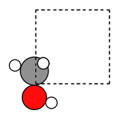

Worked Example
--------------

Initial imports
~~~~~~~~~~~~~~~

.. code:: ipython3

    from scm.plams import *
    from scm.plams.interfaces.adfsuite.ase_calculator import AMSCalculator
    from ase.optimize import BFGS
    from ase.build import molecule as ase_build_molecule
    from ase.visualize.plot import plot_atoms
    import matplotlib.pyplot as plt
    
    # In this example AMS runs in AMSWorker mode, so we have no use for the PLAMS working directory
    # Let's delete it after the calculations are done
    config.erase_workdir = True

Construct an initial system
~~~~~~~~~~~~~~~~~~~~~~~~~~~

Here, we use the ``molecule()`` from ``ase.build`` to construct an ASE
Atoms object.

You could also convert a PLAMS Molecule to the ASE format using
``toASE()``.

.. code:: ipython3

    atoms = ase_build_molecule("CH3OH")
    # alternatively:
    # atoms = toASE(from_smiles('CO'))
    
    atoms.set_pbc((True, True, True))  # 3D periodic
    atoms.set_cell([4.0, 4.0, 4.0])  # cubic box
    
    # plot the atoms
    plt.figure(figsize=(2, 2))
    plt.axis("off")
    plot_atoms(atoms, scale=0.5);

Set the AMS settings
~~~~~~~~~~~~~~~~~~~~

First, set the AMS settings as you normally would do:

.. code:: ipython3

    s = Settings()
    s.input.ams.Task = "SinglePoint"  # the geometry optimization is handled by ASE
    s.input.ams.Properties.Gradients = "Yes"  # ensures the forces are returned
    s.input.ams.Properties.StressTensor = "Yes"  # ensures the stress tensor is returned
    
    # Engine definition, could also be used to set up ADF, ReaxFF, ...
    s.input.ForceField.Type = "UFF"
    
    # run in serial
    s.runscript.nproc = 1

Run the ASE optimizer
~~~~~~~~~~~~~~~~~~~~~

.. code:: ipython3

    print("Initial coordinates:")
    print(atoms.get_positions())
    
    with AMSCalculator(settings=s, amsworker=True) as calc:
        atoms.set_calculator(calc)
        optimizer = BFGS(atoms)
        optimizer.run(fmax=0.27)  # optimize until forces are smaller than 0.27 eV/ang
    
    print(f"Optimized energy (eV): {atoms.get_potential_energy()}")
    print("Optimized coordinates:")
    print(atoms.get_positions())

.. parsed-literal::

    Initial coordinates:
    [[-0.047131  0.664389  0.      ]
     [-0.047131 -0.758551  0.      ]
     [-1.092995  0.969785  0.      ]
     [ 0.878534 -1.048458  0.      ]
     [ 0.437145  1.080376  0.891772]
     [ 0.437145  1.080376 -0.891772]]
          Step     Time          Energy         fmax
    BFGS:    0 15:41:44        0.424475        3.0437
    BFGS:    1 15:41:44        0.354817        2.8239
    BFGS:    2 15:41:44        0.270256        0.9678
    BFGS:    3 15:41:44        0.223897        0.6128
    BFGS:    4 15:41:44        0.200223        0.5503
    BFGS:    5 15:41:44        0.196200        0.1861
    Optimized energy (eV): 0.19620006656661343
    Optimized coordinates:
    [[-7.36222829e-02  6.46660224e-01 -2.64165697e-17]
     [-4.27710560e-02 -7.22615924e-01  8.03241547e-18]
     [-1.12651815e+00  9.85598502e-01  7.26450168e-18]
     [ 9.22587449e-01 -9.45309675e-01  6.26464128e-18]
     [ 4.42945518e-01  1.01179194e+00  9.09790370e-01]
     [ 4.42945518e-01  1.01179194e+00 -9.09790370e-01]]

Finish PLAMS
~~~~~~~~~~~~

.. code:: ipython3

    finish()

.. parsed-literal::

    [14.12|15:41:44] PLAMS run finished. Goodbye

