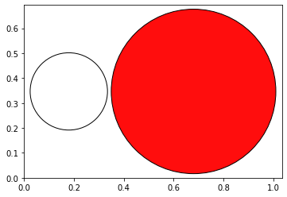

Initial imports
---------------

.. code:: ipython3

    from scm.plams import *
    from ase import Atoms
    from ase.visualize.plot import plot_atoms
    
    # Before running AMS jobs, you need to call init()
    init()

.. parsed-literal::

    PLAMS working folder: /home/user/amshome/scripting/scm/plams/doc/source/examples/AMSCalculator/plams_workdir

Construct a charged ion
-----------------------

Create a charged ion using using ``ase.Atoms`` and setting the ``info``
dictionairy.

.. code:: ipython3

    atoms = Atoms('OH',
                  positions = [[1.0,0.0,0.0],[0.0,0.0,0.0]]
                 )
    #define a total charge
    atoms.info['charge'] = -1
    
    plot_atoms(atoms, scale=0.5);

.. image:: ChargedAMSCalculator.include_files/ChargedAMSCalculator.include_3_0.png

Set the AMS settings
--------------------

First, set the AMS settings as you normally would do:

.. code:: ipython3

    settings = Settings()
    settings.input.ADF #Use ADF with the default settings
    settings.input.ams.Task = "SinglePoint"

Run AMS
-------

.. code:: ipython3

    calc = AMSCalculator(settings = settings, name='total_charge')
    atoms.calc = calc
    
    atoms.get_potential_energy() #calculate the energy of a charged ion

.. parsed-literal::

    [22.02|16:58:59] JOB total_charge1 STARTED
    [22.02|16:58:59] JOB total_charge1 RUNNING
    [22.02|16:59:00] JOB total_charge1 FINISHED
    [22.02|16:59:00] JOB total_charge1 SUCCESSFUL

.. parsed-literal::

    -8.325219526819573

AMS used the following input file:

.. code:: ipython3

    print(calc.amsresults.job.get_input())

.. parsed-literal::

    Task SinglePoint
    
    system
      Atoms
                  O       1.0000000000       0.0000000000       0.0000000000 
                  H       0.0000000000       0.0000000000       0.0000000000 
      End
      Charge -1.0
    End
    
    Engine ADF
    EndEngine
    
    

Construct a charged ion with atomic charges
-------------------------------------------

.. code:: ipython3

    atoms = Atoms('OH',
                  positions = [[1.0,0.0,0.0],[0.0,0.0,0.0]],
                  charges = [-1, 0]
                 )
    
    plot_atoms(atoms, scale=0.5);

Run AMS
-------

.. code:: ipython3

    calc = AMSCalculator(settings = settings, name='atomic_charges')
    atoms.calc = calc
    
    atoms.get_potential_energy() #calculate the energy of a charged ion

.. parsed-literal::

    [22.02|16:59:00] JOB atomic_charges1 STARTED
    [22.02|16:59:00] Job atomic_charges1 previously run as total_charge1, using old results
    [22.02|16:59:00] JOB atomic_charges1 COPIED

.. parsed-literal::

    -8.325219526819573

AMS only considers the total charge of the system and not the individual
atomic charges. PLAMS thus reuses the results of the previous
calculation since the calculation is for the same chemical system. Both
input options are allowed. If both input options are used, the total
charge is the sum of both.

.. code:: ipython3

    print(calc.amsresults.job.get_input())

.. parsed-literal::

    Task SinglePoint
    
    system
      Atoms
                  O       1.0000000000       0.0000000000       0.0000000000 
                  H       0.0000000000       0.0000000000       0.0000000000 
      End
      Charge -1.0
    End
    
    Engine ADF
    EndEngine
    
    

Setting the charge as a calculator property
-------------------------------------------

A charge can be set for the calculator in the settings object.

.. code:: ipython3

    atoms = Atoms('OH',
                  positions = [[1.0,0.0,0.0],[0.0,0.0,0.0]]
                 )
    
    settings = Settings()
    settings.input.ADF #Use ADF with the default settings
    settings.input.ams.Task = "SinglePoint"
    settings.input.ams.System.Charge = -1
    
    calc = AMSCalculator(settings = settings, name='default_charge')
    atoms.calc = calc
    atoms.get_potential_energy() #calculate the energy of a charged ion
    print(calc.amsresults.job.get_input())

.. parsed-literal::

    [22.02|16:59:01] JOB default_charge1 STARTED
    [22.02|16:59:01] JOB default_charge1 RUNNING
    [22.02|16:59:03] JOB default_charge1 FINISHED
    [22.02|16:59:03] JOB default_charge1 SUCCESSFUL
    System
      Atoms
                  O       1.0000000000       0.0000000000       0.0000000000 
                  H       0.0000000000       0.0000000000       0.0000000000 
      End
      Charge -1
    End
    
    Task SinglePoint
    
    Engine ADF
    EndEngine
    
    

In this case, the charge of the ``Atoms`` object is no longer used.

.. code:: ipython3

    atoms = Atoms('OH',
                  positions = [[1.0,0.0,0.0],[0.0,0.0,0.0]],
                 )
    atoms.info['charge'] = 100
    
    settings = Settings()
    settings.input.ADF #Use ADF with the default settings
    settings.input.ams.Task = "SinglePoint"
    settings.input.ams.System.Charge = -1
    
    calc = AMSCalculator(settings = settings, name='default_charge_overridden')
    atoms.calc = calc
    atoms.get_potential_energy() #calculate the energy of a charged ion
    print(calc.amsresults.job.get_input())

.. parsed-literal::

    [22.02|16:59:03] JOB default_charge_overridden1 STARTED
    [22.02|16:59:03] Job default_charge_overridden1 previously run as default_charge1, using old results
    [22.02|16:59:03] JOB default_charge_overridden1 COPIED
    System
      Atoms
                  O       1.0000000000       0.0000000000       0.0000000000 
                  H       0.0000000000       0.0000000000       0.0000000000 
      End
      Charge -1
    End
    
    Task SinglePoint
    
    Engine ADF
    EndEngine
    
    

Finish PLAMS
------------

.. code:: ipython3

    finish()

.. parsed-literal::

    [22.02|16:59:03] PLAMS run finished. Goodbye

