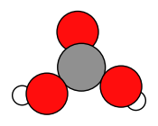
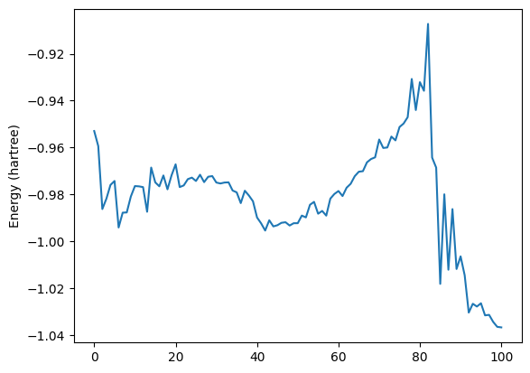
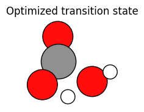

Worked Example
--------------

Initial imports
~~~~~~~~~~~~~~~

.. code:: ipython3

   from scm.plams import *
   import os
   import numpy as np
   import matplotlib.pyplot as plt

   # this line is not required in AMS2025+
   init()

::

   PLAMS working folder: /path/plams/examples/AMSPlumedMD/plams_workdir

Initial system
~~~~~~~~~~~~~~

Define a Molecule from xyz coordinates and show the molecule.

-  O(3) is the right-most O atom
-  H(6) is the left-most H atom

.. code:: ipython3

   def get_molecule():
       job = AMSJob.from_input(
           """
       system
         Atoms
                     O      -0.1009275285       1.5113007791      -0.4061554537 
                     C       0.0189044656       0.3835929386       0.1570043855
                     O       1.2796450751      -0.2325516597       0.3936038789
                     O      -1.0798994361      -0.4640886294       0.4005134306
                     H       1.7530114719      -0.6822230417      -0.3461237499
                     H      -1.8707340481      -0.5160303870      -0.1988424913
         End
       End
       """
       )
       return job.molecule[""]

.. code:: ipython3

   mol = get_molecule()

   try:
       plot_molecule(mol)  # plot Molecule in Jupyter Notebook in AMS2023+
   except NameError:
       pass  # ignore errors in AMS2022-

Calculation settings
~~~~~~~~~~~~~~~~~~~~

.. code:: ipython3

   current_O3H6 = mol[3].distance_to(mol[6])
   target_O3H6 = 0.95

   print(f"Scanning bond O3-H6 from {current_O3H6:.3f} to {target_O3H6:.3f} angstrom (this will form a water molecule)")

   current_O1C2 = mol[1].distance_to(mol[2])

   print(f"Restraining bond O1-C2 at {current_O1C2:.3f} angstrom")

::

   Scanning bond O3-H6 from 3.218 to 0.950 angstrom (this will form a water molecule)
   Restraining bond O1-C2 at 1.266 angstrom

.. code:: ipython3

   nsteps = 10000  # number of MD steps
   kappa = 500000.0  # strength of Plumed MovingRestraint

   s = Settings()
   # run in serial
   s.runscript.nproc = 1
   s.runscript.preamble_lines = ["export OMP_NUM_THREADS=1"]

   # engine settings
   s.input.ReaxFF.ForceField = "CHO.ff"  # If you have ReaxFF license
   # s.input.MLPotential.Model = 'M3GNet-UP-2022'   # if you have ML potential license and M3Gnet installed
   # s.input.dftb  # if you have a DFTB license

   # MD settings
   s.input.ams.Task = "MolecularDynamics"
   s.input.ams.MolecularDynamics.NSteps = nsteps
   s.input.ams.MolecularDynamics.Trajectory.SamplingFreq = 100
   s.input.ams.MolecularDynamics.InitialVelocities.Temperature = 200
   s.input.ams.MolecularDynamics.Thermostat.Temperature = 500
   s.input.ams.MolecularDynamics.Thermostat.Tau = 100
   s.input.ams.MolecularDynamics.Thermostat.Type = "Berendsen"

   # use an AMS restraint for one of the C-O bond lengths
   s.input.ams.Restraints.Distance = []
   s.input.ams.Restraints.Distance.append(f"1 2 {current_O1C2} 1.0")

   # use an AMS EngineAddon WallPotential to keep the molecules within a sphere of radius 4 angstrom
   s.input.ams.EngineAddons.WallPotential.Enabled = "Yes"
   s.input.ams.EngineAddons.WallPotential.Radius = 4.0

   # Plumed input, note that distances are given in nanometer so multiply by 0.1
   s.input.ams.MolecularDynamics.Plumed.Input = f"""
       DISTANCE ATOMS=3,6 LABEL=d36
       MOVINGRESTRAINT ARG=d36 STEP0=1 AT0={current_O3H6*0.1} KAPPA0={kappa} STEP1={nsteps} AT1={target_O3H6*0.1}
       PRINT ARG=d36 FILE=colvar-d36.dat STRIDE=20
       End"""

   job = AMSJob(settings=s, molecule=mol, name="dissociating-carbonic-acid")
   print(job.get_input())

::

   EngineAddons
     WallPotential
       Enabled Yes
       Radius 4.0
     End
   End

   MolecularDynamics
     InitialVelocities
       Temperature 200
     End
     NSteps 10000
     Plumed
       Input 
       DISTANCE ATOMS=3,6 LABEL=d36
       MOVINGRESTRAINT ARG=d36 STEP0=1 AT0=0.32181114819547796 KAPPA0=500000.0 STEP1=10000 AT1=0.095
       PRINT ARG=d36 FILE=colvar-d36.dat STRIDE=20
       End
     End
     Thermostat
       Tau 100
       Temperature 500
       Type Berendsen
     End
     Trajectory
       SamplingFreq 100
     End
   End

   Restraints
     Distance 1 2 1.2661886450379047 1.0
   End

   Task MolecularDynamics

   System
     Atoms
                 O      -0.1009275285       1.5113007791      -0.4061554537
                 C       0.0189044656       0.3835929386       0.1570043855
                 O       1.2796450751      -0.2325516597       0.3936038789
                 O      -1.0798994361      -0.4640886294       0.4005134306
                 H       1.7530114719      -0.6822230417      -0.3461237499
                 H      -1.8707340481      -0.5160303870      -0.1988424913
     End
   End

   Engine ReaxFF
     ForceField CHO.ff
   EndEngine

Run the job
~~~~~~~~~~~

.. code:: ipython3

   job.run();

::

   [10.02|14:24:55] JOB dissociating-carbonic-acid STARTED
   [10.02|14:24:55] JOB dissociating-carbonic-acid RUNNING
   [10.02|14:24:58] JOB dissociating-carbonic-acid FINISHED
   [10.02|14:24:58] JOB dissociating-carbonic-acid SUCCESSFUL

Analyze the trajectory
~~~~~~~~~~~~~~~~~~~~~~

Extract the O3H6 distances at each stored frame, and plot some of the molecules

.. code:: ipython3

   trajectory = Trajectory(job.results.rkfpath())

   every = 20  # picture every 20 frames in the trajectory
   N_images = np.int_(np.ceil(len(trajectory) / every))
   fig, axes = plt.subplots(1, N_images, figsize=(10, 3))

   O3H6_distances = []
   i_ax = 0

   for i, mol in enumerate(trajectory, 1):
       O3H6_distances.append(mol[3].distance_to(mol[6]))
       if i % every == 1:
           try:
               plot_molecule(mol, ax=axes[i_ax])  # mol is a PLAMS Molecule
               axes[i_ax].set_title(f"frame {i}")
               i_ax += 1
           except NameError:
               pass

The above pictures show how the H(6) approaches the O(3). At the end, the carbonic acid molecule has dissociated into CO2 and H2O.

.. code:: ipython3

   plt.plot(O3H6_distances)
   plt.ylabel("Distance (angstrom)")
   plt.xlabel("Frame")
   plt.title("O3-H6 distance")
   plt.show()

.. code:: ipython3

   energies = job.results.get_history_property("Energy")
   plt.plot(energies)
   plt.ylabel("Energy (hartree)")
   plt.show()

A transition state search
~~~~~~~~~~~~~~~~~~~~~~~~~

PLAMS makes it easy to extract any frame from an MD trajectory. As an example, let’s use highest-energy frame as an initial structure for a transition state search with the ADF DFT engine.

.. code:: ipython3

   index = np.argmax(energies) + 1
   approximate_ts_molecule = job.results.get_history_molecule(index)

   try:
       plot_molecule(approximate_ts_molecule)
       plt.title(f"Using frame {index} as initial approximate transition state")
   except NameError:
       pass

.. code:: ipython3

   ts_s = Settings()
   ts_s.input.ams.task = "TransitionStateSearch"
   ts_s.input.ams.GeometryOptimization.InitialHessian.Type = "Calculate"
   ts_s.input.ams.Properties.NormalModes = "Yes"
   ts_s.input.adf.xc.gga = "PBE"
   ts_job = AMSJob(settings=ts_s, molecule=approximate_ts_molecule, name="ts-search")
   ts_job.run();

::

   [10.02|14:24:59] JOB ts-search STARTED
   [10.02|14:24:59] JOB ts-search RUNNING
   [10.02|14:26:08] JOB ts-search FINISHED
   [10.02|14:26:08] JOB ts-search SUCCESSFUL

.. code:: ipython3

   try:
       plot_molecule(ts_job.results.get_main_molecule())
       plt.title("Optimized transition state")
   except NameError:
       pass

.. code:: ipython3

   print("Frequencies (at a TS there should be 1 imaginary [given as negative])")

   for f in ts_job.results.get_frequencies():
       print(f"{f:.3f} cm^-1")

::

   Frequencies (at a TS there should be 1 imaginary [given as negative])
   -1418.139 cm^-1
   319.619 cm^-1
   368.881 cm^-1
   544.479 cm^-1
   702.632 cm^-1
   743.002 cm^-1
   875.907 cm^-1
   1080.859 cm^-1
   1124.376 cm^-1
   1758.036 cm^-1
   2063.370 cm^-1
   3471.052 cm^-1
