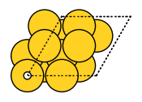

Worked Example
--------------

Initialization
~~~~~~~~~~~~~~

.. code:: ipython3

   from scm.plams import Settings, fromASE, plot_molecule
   from scm.plams.recipes.bandfragment import BANDFragmentJob

   # build the surface
   from ase import Atoms
   from ase.build import fcc111, add_adsorbate

Build Surface & Fragments
~~~~~~~~~~~~~~~~~~~~~~~~~

We first build a gold surface and add the hydrogen adsorbate.

.. code:: ipython3

   mol = fcc111("Au", size=(2, 2, 3))
   add_adsorbate(mol, "H", 1.5, "ontop")
   mol.center(vacuum=10.0, axis=2)
   plot_molecule(mol);

The system is then split into two fragments based on the species.

.. code:: ipython3

   surface = mol.copy()
   symbols = surface.get_chemical_symbols()
   del surface[[i for i in range(len(symbols)) if symbols[i] != "Au"]]
   adsorbate = mol.copy()
   del adsorbate[[i for i in range(len(symbols)) if symbols[i] == "Au"]]

If available, optimized fragments can also be loaded.

.. code:: ipython3

   # from ase import io
   # surface_opt = io.read("surface_opt.xyz")
   # adsorbate_opt = io.read("adsorbate_opt.xyz")
   # assert len(surface_opt) == len(surface)
   # assert len(adsorbate_opt) == len(adsorbate)

Set Up & Run Job
~~~~~~~~~~~~~~~~

For efficiency in this example, we use a minimal basis and reduced computational details to run the job.

.. code:: ipython3

   base_settings = Settings()
   base_settings.input.ams.task = "SinglePoint"
   base_settings.input.band.basis.type = "SZ"
   base_settings.input.band.basis.core = "Large"
   base_settings.input.band.dos.calcdos = "No"
   base_settings.input.band.kspace.regular.numberofpoints = "3 3"
   base_settings.input.band.beckegrid.quality = "Basic"
   base_settings.input.band.zlmfit.quality = "Basic"
   base_settings.input.band.usesymmetry = "No"
   base_settings.input.band.xc.gga = "PBE"
   base_settings.input.band.xc.dispersion = "Grimme4"

   eda_settings = Settings()
   eda_settings.input.band.peda = ""

   eda_job = BANDFragmentJob(
       fragment1=fromASE(surface),
       fragment2=fromASE(adsorbate),
       settings=base_settings,
       full_settings=eda_settings,
       #    fragment1_opt=fromASE(surface_opt),
       #    fragment2_opt=fromASE(adsorbate_opt),
   )

.. code:: ipython3

   eda_job.run()

::

   [25.07|16:11:02] JOB plamsjob STARTED
   [25.07|16:11:02] JOB plamsjob RUNNING
   [25.07|16:11:02] JOB plamsjob/frag1 STARTED
   [25.07|16:11:02] JOB plamsjob/frag1 RUNNING
   [25.07|16:11:49] JOB plamsjob/frag1 FINISHED
   [25.07|16:11:49] JOB plamsjob/frag1 SUCCESSFUL
   [25.07|16:11:49] JOB plamsjob/frag2 STARTED
   [25.07|16:11:49] JOB plamsjob/frag2 RUNNING
   [25.07|16:11:52] JOB plamsjob/frag2 FINISHED
   [25.07|16:11:52] JOB plamsjob/frag2 SUCCESSFUL
   ... (PLAMS log lines truncated) ...

   <scm.plams.recipes.bandfragment.BANDFragmentResults at 0x12f943e20>

Print Results
~~~~~~~~~~~~~

Finally, we extract the results of the energy decomposition:

.. code:: ipython3

   results = eda_job.results
   eda_res = eda_job.results.get_energy_decomposition()
   print("{:<20} {:>10}".format("Term", "Energy [kJ/mol]"))
   for key, value in eda_res.items():
       print("{:<20} {:>10.4f}".format(key, value))

::

   Term                 Energy [kJ/mol]
   E_int                 -181.9734
   E_int_disp              -9.1367
   E_Pauli               1122.6899
   E_elstat              -519.8489
   E_orb                 -775.6514
   E_1                  -1861.0731
   E_2                     -1.7452
