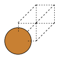
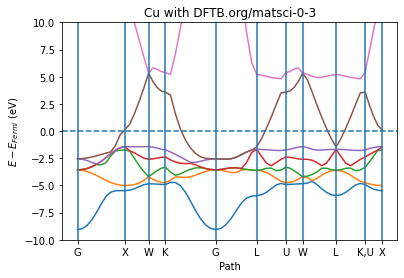
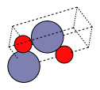
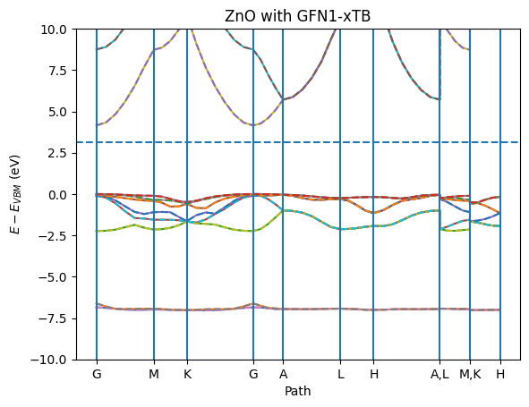
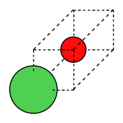
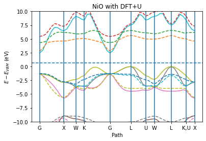

Worked Example
--------------

Initial imports
~~~~~~~~~~~~~~~

.. code:: ipython3

    from scm.plams import *
    from ase.build import bulk as ase_build_bulk
    import matplotlib.pyplot as plt
    import numpy as np

Metal band structure relative to Fermi energy
~~~~~~~~~~~~~~~~~~~~~~~~~~~~~~~~~~~~~~~~~~~~~

.. code:: ipython3

    Cu = fromASE(ase_build_bulk("Cu", "fcc", a=3.6))  # primitive cell
    plot_molecule(Cu);

.. code:: ipython3

    s = Settings()
    s.input.ams.Task = "SinglePoint"
    s.input.DFTB.Periodic.BandStructure.Enabled = "Yes"
    s.input.DFTB.Model = "SCC-DFTB"
    s.input.DFTB.ResourcesDir = "DFTB.org/matsci-0-3"
    s.runscript.nproc = 1

.. code:: ipython3

    job = AMSJob(settings=s, name="Cu", molecule=Cu)
    job.run();

.. parsed-literal::

    [23.10|17:50:30] JOB Cu STARTED
    [23.10|17:50:30] JOB Cu RUNNING
    [23.10|17:50:34] JOB Cu FINISHED
    [23.10|17:50:34] JOB Cu SUCCESSFUL

.. code:: ipython3

    x, y_spin_up, y_spin_down, labels, fermi_energy = job.results.get_band_structure(unit="eV")
    ax = plot_band_structure(x, y_spin_up, None, labels, fermi_energy, zero="fermi")
    ax.set_ylim(-10, 10)
    ax.set_ylabel("$E - E_{Fermi}$ (eV)")
    ax.set_xlabel("Path")
    ax.set_title("Cu with DFTB.org/matsci-0-3")
    plt.show()

Semiconductor band structure relative to VBM
~~~~~~~~~~~~~~~~~~~~~~~~~~~~~~~~~~~~~~~~~~~~

For a semiconductor like ZnO you can also choose to put the zero at the
VBM (‘vbm’) or CBM (‘cbm’)

.. code:: ipython3

    ZnO = fromASE(ase_build_bulk("ZnO", "wurtzite", a=3.2, c=5.3, u=0.375))
    plot_molecule(ZnO, rotation=("60x,60y,80z"));

.. code:: ipython3

    s = Settings()
    s.input.ams.Task = "SinglePoint"
    s.input.DFTB.Periodic.BandStructure.Enabled = "Yes"
    s.input.DFTB.Model = "GFN1-xTB"
    s.runscript.nproc = 1
    job = AMSJob(settings=s, molecule=ZnO, name="ZnO")
    job.run();

.. parsed-literal::

    [23.10|17:50:35] JOB ZnO STARTED
    [23.10|17:50:35] JOB ZnO RUNNING
    [23.10|17:50:37] JOB ZnO FINISHED
    [23.10|17:50:37] JOB ZnO SUCCESSFUL

The below call to ``plot_band_structure`` plots both the spin up and
spin down. The spin-down bands are plotted as dashed lines. Note that in
this case there is no spin polarization so the spin-down bands perfectly
overlap the spin-up bands.

.. code:: ipython3

    ax = plot_band_structure(*job.results.get_band_structure(unit="eV"), zero="vbmax")
    ax.set_ylim(-10, 10)
    ax.set_ylabel("$E - E_{VBM}$ (eV)")
    ax.set_xlabel("Path")
    ax.set_title("ZnO with GFN1-xTB")
    plt.show()

Spin-up and spin-down band structures
~~~~~~~~~~~~~~~~~~~~~~~~~~~~~~~~~~~~~

If you perform a spin-polarized calculation you get both spin-up and
spin-down bands. Below a spin-polarized DFT+U calculation on NiO is
performed together with the BAND engine.

.. code:: ipython3

    d = 2.085
    mol = Molecule()
    mol.add_atom(Atom(symbol="Ni", coords=(0, 0, 0)))
    mol.add_atom(Atom(symbol="O", coords=(d, d, d)))
    mol.lattice = [[0.0, d, d], [d, 0.0, d], [d, d, 0.0]]
    plot_molecule(mol);

.. code:: ipython3

    s = Settings()
    s.input.ams.task = "SinglePoint"
    s.input.band.Unrestricted = "yes"
    s.input.band.XC.GGA = "BP86"
    s.input.band.Basis.Type = "DZ"
    s.input.band.NumericalQuality = "Basic"
    s.input.band.HubbardU.Enabled = "Yes"
    s.input.band.HubbardU.UValue = "0.6 0.0"
    s.input.band.HubbardU.LValue = "2 -1"
    s.input.band.BandStructure.Enabled = "Yes"
    
    job = AMSJob(settings=s, molecule=mol, name="NiO")
    job.run();

.. parsed-literal::

    [23.10|17:50:37] JOB NiO STARTED
    [23.10|17:50:37] JOB NiO RUNNING
    [23.10|17:51:32] JOB NiO FINISHED
    [23.10|17:51:32] JOB NiO SUCCESSFUL

.. code:: ipython3

    ax = plot_band_structure(*job.results.get_band_structure(unit="eV"), zero="vbmax")
    ax.set_ylim(-10, 10)
    ax.set_ylabel("$E - E_{VBM}$ (eV)")
    ax.set_xlabel("Path")
    ax.set_title("NiO with DFT+U")
    plt.show()

