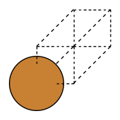

Worked Example
--------------

Initial imports
~~~~~~~~~~~~~~~

.. code:: ipython3

   from scm.plams import *
   from ase.build import bulk as ase_build_bulk
   import matplotlib.pyplot as plt
   import numpy as np

   # this line is not required in AMS2025+
   init()

::

   PLAMS working folder: /path/plams/examples/BandStructure/plams_workdir

Metal band structure relative to Fermi energy
~~~~~~~~~~~~~~~~~~~~~~~~~~~~~~~~~~~~~~~~~~~~~

.. code:: ipython3

   Cu = fromASE(ase_build_bulk("Cu", "fcc", a=3.6))  # primitive cell
   plot_molecule(Cu);

.. code:: ipython3

   s = Settings()
   s.input.ams.Task = "SinglePoint"
   s.input.DFTB.Periodic.BandStructure.Enabled = "Yes"
   s.input.DFTB.Model = "SCC-DFTB"
   s.input.DFTB.ResourcesDir = "DFTB.org/matsci-0-3"
   s.runscript.nproc = 1

.. code:: ipython3

   job = AMSJob(settings=s, name="Cu", molecule=Cu)
   job.run();

::

   [10.02|14:57:41] JOB Cu STARTED
   [10.02|14:57:41] JOB Cu RUNNING
   [10.02|14:57:46] JOB Cu FINISHED
   [10.02|14:57:46] JOB Cu SUCCESSFUL

.. code:: ipython3

   def check_ams_version():
       try:
           from scm.plams import __version__

           return __version__ >= "2024.2"
       except ImportError:
           return False

   is_ams_2025_or_higher = check_ams_version()

.. code:: ipython3

   if is_ams_2025_or_higher:
       # get_band_structure returns an axis in AMS2025+
       x, y_spin_up, y_spin_down, labels, fermi_energy = job.results.get_band_structure(unit="eV")
       ax = plot_band_structure(x, y_spin_up, None, labels, fermi_energy, zero="fermi")
       ax.set_ylim(-10, 10)
       ax.set_ylabel("$E - E_{Fermi}$ (eV)")
       ax.set_xlabel("Path")
       ax.set_title("Cu with DFTB.org/matsci-0-3")
       plt.show()
   else:
       x, y_spin_up, y_spin_down, labels, fermi_energy = job.results.get_band_structure(unit="eV")
       plot_band_structure(x, y_spin_up, None, labels, fermi_energy, zero="fermi")
       plt.ylim(-10, 10)
       plt.ylabel("$E - E_{Fermi}$ (eV)")
       plt.xlabel("Path")
       plt.title("Cu with DFTB.org/matsci-0-3")
       plt.show()

Semiconductor band structure relative to VBM
~~~~~~~~~~~~~~~~~~~~~~~~~~~~~~~~~~~~~~~~~~~~

For a semiconductor like ZnO you can also choose to put the zero at the VBM (‘vbm’) or CBM (‘cbm’)

.. code:: ipython3

   ZnO = fromASE(ase_build_bulk("ZnO", "wurtzite", a=3.2, c=5.3, u=0.375))
   plot_molecule(ZnO, rotation=("60x,60y,80z"));

.. code:: ipython3

   s = Settings()
   s.input.ams.Task = "SinglePoint"
   s.input.DFTB.Periodic.BandStructure.Enabled = "Yes"
   s.input.DFTB.Model = "GFN1-xTB"
   s.runscript.nproc = 1
   job = AMSJob(settings=s, molecule=ZnO, name="ZnO")
   job.run();

::

   [10.02|14:57:46] JOB ZnO STARTED
   [10.02|14:57:46] JOB ZnO RUNNING
   [10.02|14:57:48] JOB ZnO FINISHED
   [10.02|14:57:48] JOB ZnO SUCCESSFUL

The below call to ``plot_band_structure`` plots both the spin up and spin down. The spin-down bands are plotted as dashed lines. Note that in this case there is no spin polarization so the spin-down bands perfectly overlap the spin-up bands.

.. code:: ipython3

   if is_ams_2025_or_higher:
       # get_band_structure returns an axis in AMS2025+
       ax = plot_band_structure(*job.results.get_band_structure(unit="eV"), zero="vbmax")
       ax.set_ylim(-10, 10)
       ax.set_ylabel("$E - E_{VBM}$ (eV)")
       ax.set_xlabel("Path")
       ax.set_title("ZnO with GFN1-xTB")
       plt.show()
   else:
       plot_band_structure(*job.results.get_band_structure(unit="eV"), zero="vbmax")
       plt.ylim(-10, 10)
       plt.ylabel("$E - E_{VBM}$ (eV)")
       plt.xlabel("Path")
       plt.title("ZnO with GFN1-xTB")
       plt.show()

Spin-up and spin-down band structures
~~~~~~~~~~~~~~~~~~~~~~~~~~~~~~~~~~~~~

If you perform a spin-polarized calculation you get both spin-up and spin-down bands. Below a spin-polarized DFT+U calculation on NiO is performed together with the BAND engine.

.. code:: ipython3

   d = 2.085
   mol = Molecule()
   mol.add_atom(Atom(symbol="Ni", coords=(0, 0, 0)))
   mol.add_atom(Atom(symbol="O", coords=(d, d, d)))
   mol.lattice = [[0.0, d, d], [d, 0.0, d], [d, d, 0.0]]
   plot_molecule(mol);

.. figure:: BandStructure_files/BandStructure_14_0.png

.. code:: ipython3

   s = Settings()
   s.input.ams.task = "SinglePoint"
   s.input.band.Unrestricted = "yes"
   s.input.band.XC.GGA = "BP86"
   s.input.band.Basis.Type = "DZ"
   s.input.band.NumericalQuality = "Basic"
   s.input.band.HubbardU.Enabled = "Yes"
   s.input.band.HubbardU.UValue = "0.6 0.0"
   s.input.band.HubbardU.LValue = "2 -1"
   s.input.band.BandStructure.Enabled = "Yes"

   job = AMSJob(settings=s, molecule=mol, name="NiO")
   job.run();

::

   [10.02|14:57:49] JOB NiO STARTED
   [10.02|14:57:49] JOB NiO RUNNING
   [10.02|14:58:33] JOB NiO FINISHED
   [10.02|14:58:33] JOB NiO SUCCESSFUL

.. code:: ipython3

   if is_ams_2025_or_higher:
       # get_band_structure returns an axis in AMS2025+
       ax = plot_band_structure(*job.results.get_band_structure(unit="eV"), zero="vbmax")
       ax.set_ylim(-10, 10)
       ax.set_ylabel("$E - E_{VBM}$ (eV)")
       ax.set_xlabel("Path")
       ax.set_title("NiO with DFT+U")
       plt.show()
   else:
       plot_band_structure(*job.results.get_band_structure(unit="eV"), zero="vbmax")
       plt.ylim(-10, 10)
       plt.ylabel("$E - E_{VBM}$ (eV)")
       plt.xlabel("Path")
       plt.title("NiO with DFT+U")
       plt.show()

