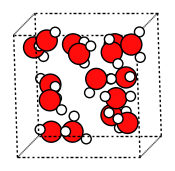

Worked Example
--------------

Initial Imports
===============

.. code:: ipython3

   import os
   import numpy as np
   import matplotlib.pyplot as plt
   from scm.plams import init, packmol, Settings, AMSJob, from_smiles, plot_molecule

Run Simple MD Simulation of Water
=================================

Run a short MD simulation of 16 water molecules in a box.

.. code:: ipython3

   # this line is not required in AMS2025+
   init()

   mol = packmol(from_smiles("O"), n_molecules=16, density=1.0)
   s = Settings()
   s.input.ams.Task = "MolecularDynamics"
   s.input.ReaxFF.ForceField = "Water2017.ff"
   s.input.ams.MolecularDynamics.CalcPressure = "Yes"
   s.input.ams.MolecularDynamics.InitialVelocities.Temperature = 300
   s.input.ams.MolecularDynamics.Trajectory.SamplingFreq = 1
   s.input.ams.MolecularDynamics.TimeStep = 0.5
   s.input.ams.MolecularDynamics.NSteps = 2000
   s.runscript.nproc = 1
   os.environ["OMP_NUM_THREADS"] = "1"
   job = AMSJob(settings=s, molecule=mol, name="md")
   job.run()

::

   PLAMS working folder: /path/plams/examples/BasicMDAnalysis/plams_workdir
   [03.03|11:50:24] JOB md STARTED
   [03.03|11:50:24] JOB md RUNNING
   [03.03|11:50:28] JOB md FINISHED
   [03.03|11:50:28] JOB md SUCCESSFUL

   <scm.plams.interfaces.adfsuite.ams.AMSResults at 0x12f4185b0>

.. code:: ipython3

   plot_molecule(mol, rotation=("80x,10y,0z"));

Or alternatively, load a previously run MD job:

.. code:: ipython3

   # job = AMSJob.load_external('/path/to/ams.rkf')
   results = job.results

Velocity Autocorrelation Function
=================================

.. code:: ipython3

   times, vacf = results.get_velocity_acf(start_fs=0, max_dt_fs=250, normalize=False)
   normalized_vacf = vacf / vacf[0]
   plt.plot(times, normalized_vacf)
   plt.xlabel("Time (fs)")
   plt.ylabel("Velocity autocorrelation function")
   plt.title("Velocity autocorrelation function")
   plt.savefig("plams_vacf.png")
   A = np.stack((times, normalized_vacf), axis=1)
   np.savetxt("plams_vacf.txt", A, header="Time(fs) VACF")

Diffusion Coefficient
=====================

.. code:: ipython3

   t_D, D = results.get_diffusion_coefficient_from_velocity_acf(times, vacf)
   plt.plot(t_D, D)
   plt.xlabel("Time (fs)")
   plt.ylabel("D (m²s⁻¹)")
   plt.title("Diffusion coefficient")
   plt.savefig("plams_vacf_D.png")
   A = np.stack((t_D, D), axis=1)
   np.savetxt("plams_vacf_D.txt", A, header="time(fs) D(m^2*s^-1)")

Power Spectrum
==============

.. code:: ipython3

   freq, intensities = results.get_power_spectrum(times, vacf, number_of_points=1000)
   plt.plot(freq, intensities)
   plt.xlabel("Frequency (cm⁻¹)")
   plt.ylabel("Power spectrum (arbitrary units)")
   plt.title("Power spectrum")
   plt.savefig("plams_power_spectrum.png")
   A = np.stack((freq, intensities), axis=1)
   np.savetxt("plams_power_spectrum.txt", A, header="Frequency(cm^-1) PowerSpectrum")

Green-Kubo Viscosity
====================

.. code:: ipython3

   t, viscosity = results.get_green_kubo_viscosity(start_fs=0, max_dt_fs=250)  # do not do this for NPT simulations
   plt.plot(t, viscosity)
   plt.xlabel("Time (fs)")
   plt.ylabel("Viscosity (mPa*s)")
   plt.title("Viscosity")
   plt.savefig("plams_green_kubo_viscosity.png")
   A = np.stack((t, viscosity), axis=1)
   np.savetxt("plams_green_kubo_viscosity.txt", A, header="Time(fs) Viscosity(mPa*s)")

Density Along Axis
==================

.. code:: ipython3

   z, density = results.get_density_along_axis(axis="z", density_type="mass", bin_width=0.2, atom_indices=None)
   plt.plot(z, density)
   plt.xlabel("z coordinate (Å)")
   plt.ylabel("Density (g/cm³)")
   plt.title("Density along z")
   plt.savefig("plams_density_along_z.png")
   A = np.stack((z, density), axis=1)
   np.savetxt("plams_density_along_z.txt", A, header="z(angstrom) density(g/cm^3)")

