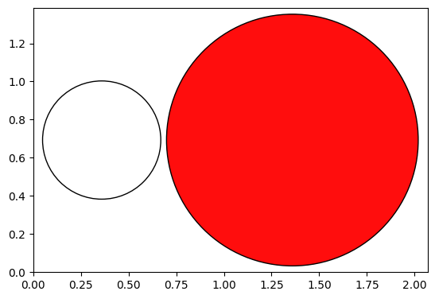
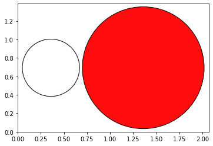

Worked Example
--------------

Initial imports
~~~~~~~~~~~~~~~

.. code:: ipython3

   from scm.plams import *
   from scm.plams.interfaces.adfsuite.ase_calculator import AMSCalculator
   from ase import Atoms
   from ase.visualize.plot import plot_atoms

   # this line is not required in AMS2025+
   init()

::

   PLAMS working folder: /path/plams/examples/ChargedAMSCalculator/plams_workdir

Example 1: Total system charge
~~~~~~~~~~~~~~~~~~~~~~~~~~~~~~

Create the charged molecule (ion)
~~~~~~~~~~~~~~~~~~~~~~~~~~~~~~~~~

Create a charged ion using using ``ase.Atoms`` and setting the ``info`` dictionary.

.. code:: ipython3

   atoms = Atoms("OH", positions=[[1.0, 0.0, 0.0], [0.0, 0.0, 0.0]])
   # define a total charge
   atoms.info["charge"] = -1

   plot_atoms(atoms);

Set the AMS settings
~~~~~~~~~~~~~~~~~~~~

First, set the AMS settings as you normally would do in PLAMS:

.. code:: ipython3

   settings = Settings()
   settings.input.ADF  # Use ADF with the default settings
   settings.input.ams.Task = "SinglePoint"

Run AMS through the ASE Calculator
~~~~~~~~~~~~~~~~~~~~~~~~~~~~~~~~~~

Below, the ``amsworker=False`` (default) will cause AMS to run in standalone mode. This means that all input and output files will be stored on disk.

.. code:: ipython3

   atoms.calc = AMSCalculator(settings=settings, name="total_charge", amsworker=False)

   energy = atoms.get_potential_energy()  # calculate the energy of a charged ion
   print(f"Energy: {energy:.3f} eV")  # ASE uses eV as energy unit

::

   [10.02|15:05:11] JOB total_charge1 STARTED
   [10.02|15:05:11] JOB total_charge1 RUNNING
   [10.02|15:05:14] JOB total_charge1 FINISHED
   [10.02|15:05:14] JOB total_charge1 SUCCESSFUL
   Energy: -8.325 eV

Access the input file
~~~~~~~~~~~~~~~~~~~~~

``atoms.calc.amsresults`` contains the corresponding PLAMS AMSResults object.

``atoms.calc.amsresults.job`` contains the corresponding PLAMS AMSJob object. This object has, for example, the ``get_input()`` method to access the input to AMS.

**Note**: These are actually properties of the Calculator, not the Atoms! So if you run more calculations with the same calculator you will **overwrite** the AMSResults in ``atoms.calc.amsresults``!

AMS used the following input:

.. code:: ipython3

   print(atoms.calc.amsresults.job.get_input())

::

   Task SinglePoint

   System
     Atoms
                 O       1.0000000000       0.0000000000       0.0000000000
                 H       0.0000000000       0.0000000000       0.0000000000
     End
     Charge -1.0
   End

   Engine ADF
   EndEngine

Access the binary .rkf results files and use PLAMS AMSResults methods
~~~~~~~~~~~~~~~~~~~~~~~~~~~~~~~~~~~~~~~~~~~~~~~~~~~~~~~~~~~~~~~~~~~~~

Access the paths to the binary results files:

.. code:: ipython3

   ams_rkf = atoms.calc.amsresults.rkfpath(file="ams")
   print(ams_rkf)

::

   /path/plams/examples/ChargedAMSCalculator/plams_workdir/total_charge1/ams.rkf

If you prefer, you can use the PLAMS methods to access results like the energy:

.. code:: ipython3

   energy2 = atoms.calc.amsresults.get_energy(unit="eV")
   print(f"Energy: {energy2:.3f} eV")

::

   Energy: -8.325 eV

Example 2: Define atomic charges
~~~~~~~~~~~~~~~~~~~~~~~~~~~~~~~~

Construct a charged ion with atomic charges
~~~~~~~~~~~~~~~~~~~~~~~~~~~~~~~~~~~~~~~~~~~

.. code:: ipython3

   atoms = Atoms("OH", positions=[[1.0, 0.0, 0.0], [0.0, 0.0, 0.0]], charges=[-1, 0])

   plot_atoms(atoms);

Run AMS
~~~~~~~

.. code:: ipython3

   calc = AMSCalculator(settings=settings, name="atomic_charges")
   atoms.calc = calc

   atoms.get_potential_energy()  # calculate the energy of a charged ion

::

   [10.02|15:05:14] JOB atomic_charges1 STARTED
   [10.02|15:05:14] Job atomic_charges1 previously run as total_charge1, using old results
   [10.02|15:05:14] JOB atomic_charges1 COPIED

   -8.325219526819566

AMS only considers the total charge of the system and not the individual atomic charges. PLAMS thus reuses the results of the previous calculation since the calculation is for the same chemical system. Both input options are allowed. If both input options are used, the total charge is the sum of both.

.. code:: ipython3

   print(calc.amsresults.job.get_input())

::

   Task SinglePoint

   System
     Atoms
                 O       1.0000000000       0.0000000000       0.0000000000
                 H       0.0000000000       0.0000000000       0.0000000000
     End
     Charge -1.0
   End

   Engine ADF
   EndEngine

Example 3: Set the charge in the AMS System block
~~~~~~~~~~~~~~~~~~~~~~~~~~~~~~~~~~~~~~~~~~~~~~~~~

Set the charge in the AMS System block
~~~~~~~~~~~~~~~~~~~~~~~~~~~~~~~~~~~~~~

A charge can be set for the calculator in the settings object.

.. code:: ipython3

   atoms = Atoms("OH", positions=[[1.0, 0.0, 0.0], [0.0, 0.0, 0.0]])

   settings = Settings()
   settings.input.ADF  # Use ADF with the default settings
   settings.input.ams.Task = "SinglePoint"
   settings.input.ams.System.Charge = -1

   calc = AMSCalculator(settings=settings, name="default_charge")
   atoms.calc = calc
   atoms.get_potential_energy()  # calculate the energy of a charged ion
   print(calc.amsresults.job.get_input())

::

   [10.02|15:05:14] JOB default_charge1 STARTED
   [10.02|15:05:14] JOB default_charge1 RUNNING
   [10.02|15:05:16] JOB default_charge1 FINISHED
   [10.02|15:05:16] JOB default_charge1 SUCCESSFUL
   Task SinglePoint

   System
     Atoms
                 O       1.0000000000       0.0000000000       0.0000000000
                 H       0.0000000000       0.0000000000       0.0000000000
     End
     Charge -1
   End

   Engine ADF
   EndEngine

In this case, the charge of the ``Atoms`` object is no longer used.

.. code:: ipython3

   atoms = Atoms(
       "OH",
       positions=[[1.0, 0.0, 0.0], [0.0, 0.0, 0.0]],
   )
   atoms.info["charge"] = 100

   settings = Settings()
   settings.input.ADF  # Use ADF with the default settings
   settings.input.ams.Task = "SinglePoint"
   settings.input.ams.System.Charge = -1

   calc = AMSCalculator(settings=settings, name="default_charge_overridden")
   atoms.calc = calc
   atoms.get_potential_energy()  # calculate the energy of a charged ion
   print(calc.amsresults.job.get_input())

::

   [10.02|15:05:16] JOB default_charge_overridden1 STARTED
   [10.02|15:05:16] Job default_charge_overridden1 previously run as default_charge1, using old results
   [10.02|15:05:16] JOB default_charge_overridden1 COPIED
   Task SinglePoint

   System
     Atoms
                 O       1.0000000000       0.0000000000       0.0000000000
                 H       0.0000000000       0.0000000000       0.0000000000
     End
     Charge -1
   End

   Engine ADF
   EndEngine
