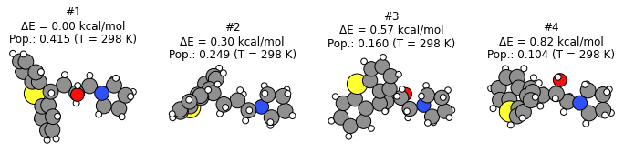

.. _conformers_example:

Conformers Generation
=======================

.. seealso::
   
   * :ref:`conformers_interface` PLAMS interface

   * `Conformers for COSMO-RS <../../../COSMO-RS/advanced_scripts/Conformers.html>`__

Example illustrating how to generate conformers with AMS.

**This example is only compatible with AMS2023**.

To follow along, either

* Download :download:`conformers.py` (run as ``$AMSBIN/amspython conformers.py``).
* Download :download:`conformers.ipynb` (see also: how to install `Jupyterlab <../../../Scripting/Python_Stack/Python_Stack.html#install-and-run-jupyter-lab-jupyter-notebooks>`__ in AMS)

.. note::

    Conformers generation depends on random numbers. You are likely to get somewhat different results if you run this example!

.. include:: conformers.rst.include

Complete Python code
----------------------------

.. literalinclude:: conformers.py
    :language: python
