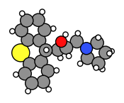
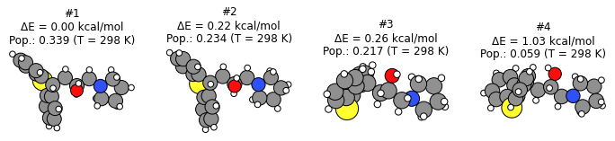
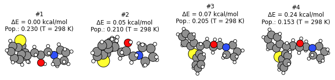
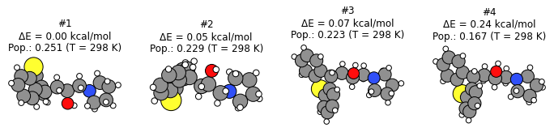

Worked Example
--------------

Initial imports
~~~~~~~~~~~~~~~

.. code:: ipython3

    import os
    
    import matplotlib.pyplot as plt
    import numpy as np
    
    from scm.conformers import ConformersJob
    from scm.plams import *

Initial structure
~~~~~~~~~~~~~~~~~

.. code:: ipython3

    molecule = from_smiles("OC(CC1c2ccccc2Sc2ccccc21)CN1CCCC1")
    plot_molecule(molecule);

Generate conformers with RDKit and UFF
~~~~~~~~~~~~~~~~~~~~~~~~~~~~~~~~~~~~~~

The fastest way to generate conformers is to use RDKit with the UFF
force field.

Below we specify to generate 16 initial conformers. The final number of
conformers may be smaller, as the geometry optimization may cause
several structures to enter the same minimum.

Conformer generation settings
~~~~~~~~~~~~~~~~~~~~~~~~~~~~~

.. code:: ipython3

    s = Settings()
    s.input.ams.Task = "Generate"  # default
    s.input.ams.Generator.Method = "RDKit"  # default
    s.input.ams.Generator.RDKit.InitialNConformers = 16  # optional, non-default
    s.input.ForceField.Type = "UFF"  # default

Conformer generation input file
~~~~~~~~~~~~~~~~~~~~~~~~~~~~~~~

.. code:: ipython3

    print(ConformersJob(settings=s).get_input())

.. parsed-literal::

    Generator
      Method RDKit
      RDKit
        InitialNConformers 16
      End
    End
    
    Task Generate
    
    Engine ForceField
      Type UFF
    EndEngine
    
    

Run conformer generation
~~~~~~~~~~~~~~~~~~~~~~~~

.. code:: ipython3

    generate_job = ConformersJob(name="generate", molecule=molecule, settings=s)
    generate_job.run()

.. parsed-literal::

    [05.03|08:59:21] JOB generate STARTED
    [05.03|08:59:21] JOB generate RUNNING
    [05.03|08:59:28] JOB generate FINISHED
    [05.03|08:59:28] JOB generate SUCCESSFUL

Conformer generation results
~~~~~~~~~~~~~~~~~~~~~~~~~~~~

Some helper functions
~~~~~~~~~~~~~~~~~~~~~

.. code:: ipython3

    def print_results(job: ConformersJob, temperature=298, unit="kcal/mol"):
        energies = job.results.get_relative_energies(unit)
        populations = job.results.get_boltzmann_distribution(temperature)
    
        print(f"Total # conformers in set: {len(energies)}")
        dE_header = f"ΔE [{unit}]"
        pop_header = f"Pop. (T = {temperature} K)"
        print(f'{"#":>4s} {dE_header:>14s} {pop_header:>18s}')
    
        for i, (E, pop) in enumerate(zip(energies, populations)):
            print(f"{i+1:4d} {E:14.2f} {pop:18.3f}")
    
    
    def plot_conformers(job: ConformersJob, indices=None, temperature=298, unit="kcal/mol", lowest=True):
        molecules = job.results.get_conformers()
        energies = job.results.get_relative_energies(unit)
        populations = job.results.get_boltzmann_distribution(temperature)
    
        if isinstance(indices, int):
            N_plot = min(indices, len(energies))
            if lowest:
                indices = list(range(N_plot))
            else:
                indices = np.linspace(0, len(energies) - 1, N_plot, dtype=np.int32)
        if indices is None:
            indices = list(range(min(3, len(energies))))
    
        fig, axes = plt.subplots(1, len(indices), figsize=(12, 3))
        if len(indices) == 1:
            axes = [axes]
    
        for ax, i in zip(axes, indices):
            mol = molecules[i]
            E = energies[i]
            population = populations[i]
    
            plot_molecule(mol, ax=ax)
            ax.set_title(f"#{i+1}\nΔE = {E:.2f} kcal/mol\nPop.: {population:.3f} (T = {temperature} K)")

Actual results
~~~~~~~~~~~~~~

Below we see that the **conformer generation gave 14 distinct
conformers**, where the highest-energy conformer is 18 kcal/mol higher
in energy than the lowest energy conformer.

You can also see the **relative populations** of these conformers at the
specified temperature. The populations are calculated from the
**Boltzmann distribution** and the relative energies.

.. code:: ipython3

    unit = "kcal/mol"
    temperature = 298

.. code:: ipython3

    print_results(generate_job, temperature=temperature, unit=unit)
    plot_conformers(generate_job, 4, temperature=temperature, unit=unit, lowest=True)  # plot 4 lowest conformers
    # plot_conformers(generate_job, 4, temperature=temperature, unit=unit, lowest=False)  # plot 4 conformers from lowest to highest
    # plot_conformers(generate_job, [0, 2], temperature=temperature, unit=unit) # plot first and third conformers

.. parsed-literal::

    Total # conformers in set: 14
       #  ΔE [kcal/mol]   Pop. (T = 298 K)
       1           0.00              0.415
       2           0.30              0.249
       3           0.57              0.160
       4           0.82              0.104
       5           1.50              0.033
       6           1.79              0.020
       7           2.25              0.009
       8           2.30              0.009
       9           3.72              0.001
      10           3.76              0.001
      11          13.99              0.000
      12          15.25              0.000
      13          17.96              0.000
      14          18.20              0.000

.. image:: conformers_files/conformers_16_1.png

Re-optimize conformers with GFNFF
~~~~~~~~~~~~~~~~~~~~~~~~~~~~~~~~~

The UFF force field is not very accurate for geometries and energies.
From an initial conformer set you can reoptimize it with a better level
of theory.

The **Optimize** task performs **GeometryOptimization** jobs on each
conformer in a set.

Below, the 10 most stable conformers (within 8 kcal/mol of the most
stable conformer) at the UFF level of theory are re-optimized with
GFNFF, which gives more accurate geometries.

.. code:: ipython3

    s = Settings()
    s.input.ams.Task = "Optimize"
    s.input.ams.InputConformersSet = os.path.abspath(generate_job.results.rkfpath())  # must be absolute path
    s.input.ams.InputMaxEnergy = 8.0  # only conformers within 8 kcal/mol at the PREVIOUS level of theory
    s.input.GFNFF  # or choose a different engine if you don't have a GFNFF license
    
    reoptimize_job = ConformersJob(settings=s, name="reoptimize")
    print(reoptimize_job.get_input())

.. parsed-literal::

    InputConformersSet /path/plams/plams_workdir/generate/conformers.rkf
    
    InputMaxEnergy 8.0
    
    Task Optimize
    
    Engine GFNFF
    EndEngine
    
    

.. code:: ipython3

    reoptimize_job.run()

.. parsed-literal::

    [05.03|08:59:28] JOB reoptimize STARTED
    [05.03|08:59:28] JOB reoptimize RUNNING
    [05.03|08:59:32] JOB reoptimize FINISHED
    [05.03|08:59:32] JOB reoptimize SUCCESSFUL

.. code:: ipython3

    print_results(reoptimize_job, temperature=temperature, unit=unit)
    plot_conformers(reoptimize_job, 4, temperature=temperature, unit=unit, lowest=True)

.. parsed-literal::

    Total # conformers in set: 10
       #  ΔE [kcal/mol]   Pop. (T = 298 K)
       1           0.00              0.339
       2           0.22              0.234
       3           0.26              0.217
       4           1.03              0.059
       5           1.07              0.055
       6           1.24              0.042
       7           1.38              0.033
       8           1.78              0.017
       9           2.72              0.003
      10           4.75              0.000

Score conformers with DFTB
~~~~~~~~~~~~~~~~~~~~~~~~~~

If you have many conformers or a very large molecule, it can be
computationally expensive to do the conformer generation or
reoptimization and a high level of theory.

The **Score** task runs **SinglePoint** jobs on the conformers in a set.
This lets you use a more computationally expensive method. Here, we
choose DFTB, although normally you may choose some DFT method.

.. code:: ipython3

    s = Settings()
    s.input.ams.Task = "Score"
    s.input.ams.InputConformersSet = os.path.abspath(reoptimize_job.results.rkfpath())  # must be absolute path
    s.input.ams.InputMaxEnergy = 4.0  # only conformers within 4 kcal/mol at the PREVIOUS level of theory
    s.input.DFTB.Model = "GFN1-xTB"  # or choose a different engine if you don't have a DFTB license
    # s.input.adf.XC.GGA = 'PBE'                       # to use ADF PBE
    # s.input.adf.XC.DISPERSION = 'GRIMME3 BJDAMP'     # to use ADF PBE with Grimme D3(BJ) dispersion
    
    score_job = ConformersJob(settings=s, name="score")
    score_job.run()

.. parsed-literal::

    [05.03|08:59:32] JOB score STARTED
    [05.03|08:59:32] JOB score RUNNING
    [05.03|08:59:34] JOB score FINISHED
    [05.03|08:59:34] JOB score SUCCESSFUL

.. code:: ipython3

    print_results(score_job, temperature=temperature, unit=unit)
    plot_conformers(score_job, 4, temperature=temperature, unit=unit, lowest=True)

.. parsed-literal::

    Total # conformers in set: 9
       #  ΔE [kcal/mol]   Pop. (T = 298 K)
       1           0.00              0.230
       2           0.05              0.210
       3           0.07              0.205
       4           0.24              0.153
       5           0.66              0.075
       6           1.00              0.043
       7           1.04              0.040
       8           1.08              0.037
       9           2.01              0.008

Here, you see that from the conformers in the set, **DFTB predicts a
different lowest-energy conformer than GFNFF** (compare to previous
figure).

Filter a conformer set
~~~~~~~~~~~~~~~~~~~~~~

In practice, you may have generated thousands of conformers for a
particular structure. Many of those conformers may be so high in energy
that their Boltzmann weights are very small.

The **Filter** task only filters the conformers, it does not perform any
additional calculations. It can be used to reduce a conformer set so
that it is more convenient to work with.

Below, we filter the conformers set to only the conformers within 1
kcal/mol of the minimum.

.. code:: ipython3

    s = Settings()
    s.input.ams.Task = "Filter"
    s.input.ams.InputConformersSet = os.path.abspath(score_job.results.rkfpath())
    s.input.ams.InputMaxEnergy = 1.0
    
    filter_job = ConformersJob(settings=s, name="filter")
    filter_job.run()
    print_results(filter_job, temperature=temperature, unit=unit)
    plot_conformers(filter_job, 4, temperature=temperature, unit=unit, lowest=True)

.. parsed-literal::

    [05.03|09:20:16] JOB filter STARTED
    [05.03|09:20:16] JOB filter RUNNING
    [05.03|09:20:17] JOB filter FINISHED
    [05.03|09:20:17] JOB filter SUCCESSFUL
    Total # conformers in set: 6
       #  ΔE [kcal/mol]   Pop. (T = 298 K)
       1           0.00              0.251
       2           0.05              0.229
       3           0.07              0.223
       4           0.24              0.167
       5           0.66              0.082
       6           1.00              0.047

The structures and energies are identical to before. However, the
relative populations changed slightly as there are now fewer conformers
in the set.

More about conformers
~~~~~~~~~~~~~~~~~~~~~

-  Try **CREST** instead of RDKit to generate the initial conformer set

-  The **Expand** task can be used to expand a set of conformers.
