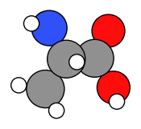
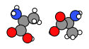
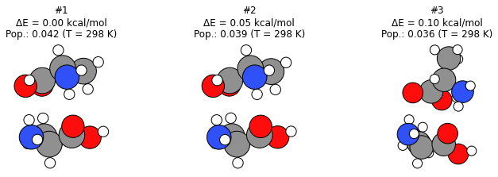

Worked Example
--------------

Lets see how two alanine molecules orient themselves using CREST
conformer generation. To do this we will constrain the system in a
spherical region using the ``SphericalWall`` constraint. We start by
setting up a system of two alanine molecules in a relatively small
space.

Initial imports
~~~~~~~~~~~~~~~

.. code:: ipython3

    import scm.plams as plams
    from scm.conformers import ConformersJob
    from scm.conformers.plams.plot import plot_conformers
    import numpy as np
    import matplotlib.pyplot as plt
    import os

Single alanine molecule
~~~~~~~~~~~~~~~~~~~~~~~

.. code:: ipython3

    smiles = "CC(N)C(=O)O"
    alanine = plams.from_smiles(smiles)
    plams.plot_molecule(alanine);

Initial system: alanine dimer
~~~~~~~~~~~~~~~~~~~~~~~~~~~~~

Pack two alanine molecules in a sphere with a density of 0.5 kg/L.

.. code:: ipython3

    density = 0.5
    mol = plams.packmol(alanine, n_molecules=2, density=density, sphere=True)

Translate the molecule to be centered around the origin (needed for
SphericalWall later):

.. code:: ipython3

    mol.translate(-np.array(mol.get_center_of_mass()))

.. code:: ipython3

    plams.plot_molecule(mol, rotation="0x,0y,90z");

Calculation setup
~~~~~~~~~~~~~~~~~

To determine the radius of the ``SphericalWall`` we measure the size of
the initial dimer.

.. code:: ipython3

    dists = plams.distance_array(mol, mol)
    max_dist = np.max(dists)
    diameter = 1.33 * max_dist
    radius = diameter / 2
    print(f"Largest distance between atoms: {max_dist:.3f} ang.")
    print(f"Radius: {radius:.3f} ang.")

.. parsed-literal::

    Largest distance between atoms: 9.882 ang.
    Radius: 6.572 ang.

Now we can set up the Crest conformer generation job, with the
appropriate spherical wall constraining the molecules close together.

.. code:: ipython3

    settings = plams.Settings()
    settings.input.ams.EngineAddons.WallPotential.Enabled = "Yes"
    settings.input.ams.EngineAddons.WallPotential.Radius = radius
    settings.input.ams.Generator.Method = "CREST"
    settings.input.ams.Output.KeepWorkDir = "Yes"
    settings.input.ams.GeometryOptimization.MaxConvergenceTime = "High"
    settings.input.ams.Generator.CREST.NCycles = 3  # at most 3 CREST cycles for this demo
    settings.input.GFNFF = plams.Settings()

Run the conformers job
~~~~~~~~~~~~~~~~~~~~~~

Now we can run the conformer generation job.

.. code:: ipython3

    job = ConformersJob(molecule=mol, settings=settings)
    job.run()
    # ConformersJob.load_external("plams_workdir/conformers/conformers.rkf")  # load from disk instead of running the job

.. parsed-literal::

    [11.03|15:40:06] JOB conformers STARTED
    [11.03|15:40:06] JOB conformers RUNNING
    [11.03|15:48:41] JOB conformers FINISHED
    [11.03|15:48:41] JOB conformers SUCCESSFUL

.. parsed-literal::

    <scm.conformers.plams.interface.ConformersResults at 0x7f97c3b278e0>

.. code:: ipython3

    rkf = job.results.rkfpath()
    print(f"Conformers stored in {rkf}")

.. parsed-literal::

    Conformers stored in /home/hellstrom/temp/confmul-Xni-2024-Mar-11/plams_workdir.005/conformers/conformers.rkf

This job will run for approximately 15 minutes.

Results
~~~~~~~

Here we plot the three lowest-energy conformers.

.. code:: ipython3

    plot_conformers(job);

You can also open the conformers in AMSmovie to browse all conformers
1000+ conformers:

.. code:: ipython3

    !amsmovie {rkf}
