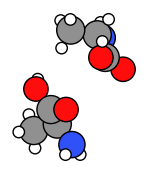

Worked Example
--------------

Lets see how two alanine molecules orient themselves using CREST
conformer generation. To do this we will constrain the system in a
spherical region using the ``SphericalWall`` constraint. We start by
setting up a system of two alanine molecules in a relatively small
space.

Initial imports
~~~~~~~~~~~~~~~

.. code:: ipython3

    import scm.plams as plams
    import sys
    from scm.conformers import ConformersJob
    from scm.conformers.plams.plot import plot_conformers
    import numpy as np
    import matplotlib.pyplot as plt
    import os
    
    plams.init();  # this line is not required in AMS2025+

Single alanine molecule
~~~~~~~~~~~~~~~~~~~~~~~

.. code:: ipython3

    smiles = "CC(N)C(=O)O"
    alanine = plams.from_smiles(smiles)
    plams.plot_molecule(alanine);

Initial system: alanine dimer
~~~~~~~~~~~~~~~~~~~~~~~~~~~~~

Pack two alanine molecules in a sphere with a density of 0.5 kg/L.

.. code:: ipython3

    density = 0.5
    mol = plams.packmol(alanine, n_molecules=2, density=density, sphere=True)

Translate the molecule to be centered around the origin (needed for
SphericalWall later):

.. code:: ipython3

    mol.translate(-np.array(mol.get_center_of_mass()))

.. code:: ipython3

    plams.plot_molecule(mol, rotation="0x,0y,90z");

Calculation setup
~~~~~~~~~~~~~~~~~

To determine the radius of the ``SphericalWall`` we measure the size of
the initial dimer.

.. code:: ipython3

    dists = plams.distance_array(mol, mol)
    max_dist = np.max(dists)
    diameter = 1.33 * max_dist
    radius = diameter / 2
    print(f"Largest distance between atoms: {max_dist:.3f} ang.")
    print(f"Radius: {radius:.3f} ang.")

.. parsed-literal::

    Largest distance between atoms: 8.397 ang.
    Radius: 5.584 ang.

Now we can set up the Crest conformer generation job, with the
appropriate spherical wall constraining the molecules close together.

.. code:: ipython3

    settings = plams.Settings()
    settings.input.ams.EngineAddons.WallPotential.Enabled = "Yes"
    settings.input.ams.EngineAddons.WallPotential.Radius = radius
    settings.input.ams.Generator.Method = "CREST"
    settings.input.ams.Output.KeepWorkDir = "Yes"
    settings.input.ams.GeometryOptimization.MaxConvergenceTime = "High"
    settings.input.ams.Generator.CREST.NCycles = 3  # at most 3 CREST cycles for this demo
    settings.input.GFNFF = plams.Settings()

Run the conformers job
~~~~~~~~~~~~~~~~~~~~~~

Now we can run the conformer generation job.

.. code:: ipython3

    job = ConformersJob(molecule=mol, settings=settings)
    job.run()
    # ConformersJob.load_external("plams_workdir/conformers/conformers.rkf")  # load from disk instead of running the job

.. parsed-literal::

    [04.02|15:45:58] JOB conformers STARTED
    [04.02|15:45:58] JOB conformers RUNNING
    [04.02|15:57:08] JOB conformers FINISHED
    [04.02|15:57:08] JOB conformers SUCCESSFUL

.. parsed-literal::

    <scm.conformers.plams.interface.ConformersResults at 0x16786fb20>

.. code:: ipython3

    rkf = job.results.rkfpath()
    print(f"Conformers stored in {rkf}")

.. parsed-literal::

    Conformers stored in /path/plams/examples/ConformersMultipleMolecules/plams_workdir/conformers/conformers.rkf

This job will run for approximately 15 minutes.

Results
~~~~~~~

Here we plot the three lowest-energy conformers.

.. code:: ipython3

    plot_conformers(job);

.. image:: conformers_files/conformers_22_0.png

You can also open the conformers in AMSmovie to browse all conformers
1000+ conformers:

.. code:: ipython3

    !amsmovie {rkf}

Finally in AMS2025, you can also inspect the conformer data using the
JobAnalysis tool.

.. code:: ipython3

    try:
        from scm.plams import JobAnalysis
    
        ja = (
            JobAnalysis(std_fields=None)
            .add_job(job)
            .add_field(
                "Id",
                lambda j: list(range(1, len(j.results.get_conformers()) + 1)),
                display_name="Conformer Id",
                expand=True,
            )
            .add_field(
                "Energies", lambda j: j.results.get_relative_energies("kcal/mol"), display_name="E", expand=True, fmt=".2f"
            )
            .add_field(
                "Populations", lambda j: j.results.get_boltzmann_distribution(298), display_name="P", expand=True, fmt=".3f"
            )
        )
    
        # Pretty-print if running in a notebook
        if "ipykernel" in sys.modules:
            ja.display_table(max_rows=20)
        else:
            print(ja.to_table())
    
    except ImportError:
        pass

.. raw:: html

    

    <table border="1" style="border-collapse: collapse; width: auto; ">
    <thead><tr><th>Conformer Id<th>E     <th>P    </th></tr></thead>
    <tbody>
    <tr><td>1           </td><td>0.00  </td><td>0.036</td></tr>
    <tr><td>2           </td><td>0.01  </td><td>0.035</td></tr>
    <tr><td>3           </td><td>0.03  </td><td>0.034</td></tr>
    <tr><td>4           </td><td>0.03  </td><td>0.034</td></tr>
    <tr><td>5           </td><td>0.08  </td><td>0.031</td></tr>
    <tr><td>6           </td><td>0.13  </td><td>0.029</td></tr>
    <tr><td>7           </td><td>0.15  </td><td>0.028</td></tr>
    <tr><td>8           </td><td>0.18  </td><td>0.026</td></tr>
    <tr><td>9           </td><td>0.22  </td><td>0.024</td></tr>
    <tr><td>10          </td><td>0.23  </td><td>0.024</td></tr>
    <tr><td>...         </td><td>...   </td><td>...  </td></tr>
    <tr><td>1807        </td><td>135.93</td><td>0.000</td></tr>
    <tr><td>1808        </td><td>137.12</td><td>0.000</td></tr>
    <tr><td>1809        </td><td>138.93</td><td>0.000</td></tr>
    <tr><td>1810        </td><td>139.38</td><td>0.000</td></tr>
    <tr><td>1811        </td><td>140.51</td><td>0.000</td></tr>
    <tr><td>1812        </td><td>143.04</td><td>0.000</td></tr>
    <tr><td>1813        </td><td>148.33</td><td>0.000</td></tr>
    <tr><td>1814        </td><td>152.45</td><td>0.000</td></tr>
    <tr><td>1815        </td><td>164.99</td><td>0.000</td></tr>
    <tr><td>1816        </td><td>201.42</td><td>0.000</td></tr>
    </tbody>
    </table>
    

