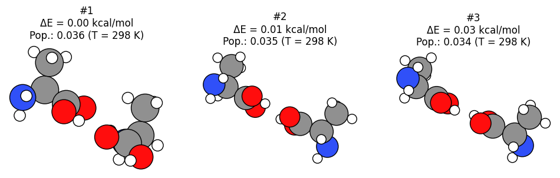

Worked Example
--------------

Lets see how two alanine molecules orient themselves using CREST conformer generation. To do this we will constrain the system in a spherical region using the ``SphericalWall`` constraint. We start by setting up a system of two alanine molecules in a relatively small space.

Initial imports
~~~~~~~~~~~~~~~

.. code:: ipython3

   import scm.plams as plams
   import sys
   from scm.conformers import ConformersJob
   from scm.conformers.plams.plot import plot_conformers
   import numpy as np
   import matplotlib.pyplot as plt
   import os

   # this line is not required in AMS2025+
   plams.init();

Single alanine molecule
~~~~~~~~~~~~~~~~~~~~~~~

.. code:: ipython3

   smiles = "CC(N)C(=O)O"
   alanine = plams.from_smiles(smiles)
   plams.plot_molecule(alanine);

.. figure:: conformers_files/conformers_4_0.png

Initial system: alanine dimer
~~~~~~~~~~~~~~~~~~~~~~~~~~~~~

Pack two alanine molecules in a sphere with a density of 0.5 kg/L.

.. code:: ipython3

   density = 0.5
   mol = plams.packmol(alanine, n_molecules=2, density=density, sphere=True)

Translate the molecule to be centered around the origin (needed for SphericalWall later):

.. code:: ipython3

   mol.translate(-np.array(mol.get_center_of_mass()))

.. code:: ipython3

   plams.plot_molecule(mol, rotation="0x,0y,90z");

.. figure:: conformers_files/conformers_10_0.png

Calculation setup
~~~~~~~~~~~~~~~~~

To determine the radius of the ``SphericalWall`` we measure the size of the initial dimer.

.. code:: ipython3

   dists = plams.distance_array(mol, mol)
   max_dist = np.max(dists)
   diameter = 1.33 * max_dist
   radius = diameter / 2
   print(f"Largest distance between atoms: {max_dist:.3f} ang.")
   print(f"Radius: {radius:.3f} ang.")

::

   Largest distance between atoms: 8.397 ang.
   Radius: 5.584 ang.

Now we can set up the Crest conformer generation job, with the appropriate spherical wall constraining the molecules close together.

.. code:: ipython3

   settings = plams.Settings()
   settings.input.ams.EngineAddons.WallPotential.Enabled = "Yes"
   settings.input.ams.EngineAddons.WallPotential.Radius = radius
   settings.input.ams.Generator.Method = "CREST"
   settings.input.ams.Output.KeepWorkDir = "Yes"
   settings.input.ams.GeometryOptimization.MaxConvergenceTime = "High"
   settings.input.ams.Generator.CREST.NCycles = 3  # at most 3 CREST cycles for this demo
   settings.input.GFNFF = plams.Settings()

Run the conformers job
~~~~~~~~~~~~~~~~~~~~~~

Now we can run the conformer generation job.

.. code:: ipython3

   job = ConformersJob(molecule=mol, settings=settings)
   job.run()
   # ConformersJob.load_external("plams_workdir/conformers/conformers.rkf")  # load from disk instead of running the job

::

   [04.02|15:45:58] JOB conformers STARTED
   [04.02|15:45:58] JOB conformers RUNNING
   [04.02|15:57:08] JOB conformers FINISHED
   [04.02|15:57:08] JOB conformers SUCCESSFUL

   <scm.conformers.plams.interface.ConformersResults at 0x16786fb20>

.. code:: ipython3

   rkf = job.results.rkfpath()
   print(f"Conformers stored in {rkf}")

::

   Conformers stored in /path/plams/examples/ConformersMultipleMolecules/plams_workdir/conformers/conformers.rkf

This job will run for approximately 15 minutes.

Results
~~~~~~~

Here we plot the three lowest-energy conformers.

.. code:: ipython3

   plot_conformers(job);

You can also open the conformers in AMSmovie to browse all conformers 1000+ conformers:

.. code:: ipython3

   !amsmovie {rkf}

Finally in AMS2025, you can also inspect the conformer data using the JobAnalysis tool.

.. code:: ipython3

   try:
       from scm.plams import JobAnalysis

       ja = (
           JobAnalysis(standard_fields=None)
           .add_job(job)
           .add_field(
               "Id",
               lambda j: list(range(1, len(j.results.get_conformers()) + 1)),
               display_name="Conformer Id",
               expansion_depth=1,
           )
           .add_field(
               "Energies",
               lambda j: j.results.get_relative_energies("kcal/mol"),
               display_name="E",
               expansion_depth=1,
               fmt=".2f",
           )
           .add_field(
               "Populations",
               lambda j: j.results.get_boltzmann_distribution(298),
               display_name="P",
               expansion_depth=1,
               fmt=".3f",
           )
       )

       # Pretty-print if running in a notebook
       if "ipykernel" in sys.modules:
           ja.display_table(max_rows=20)
       else:
           print(ja.to_table())

   except ImportError:
       pass

============ ====== =====
Conformer Id E      P
============ ====== =====
1            0.00   0.036
2            0.01   0.035
3            0.03   0.034
4            0.03   0.034
5            0.08   0.031
6            0.13   0.029
7            0.15   0.028
8            0.18   0.026
9            0.22   0.024
10           0.23   0.024
…            …      …
1807         135.93 0.000
1808         137.12 0.000
1809         138.93 0.000
1810         139.38 0.000
1811         140.51 0.000
1812         143.04 0.000
1813         148.33 0.000
1814         152.45 0.000
1815         164.99 0.000
1816         201.42 0.000
============ ====== =====
