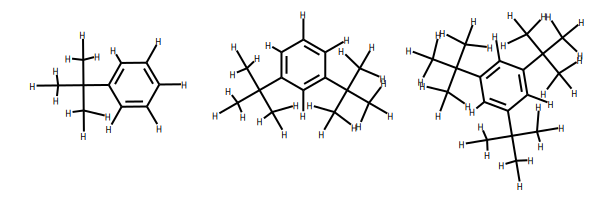
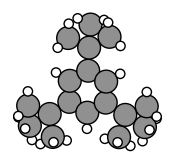
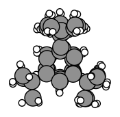
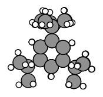

Worked Example
--------------

Constrained geometry optimizations with the AMSWorker
~~~~~~~~~~~~~~~~~~~~~~~~~~~~~~~~~~~~~~~~~~~~~~~~~~~~~

The ``AMSWorker`` class allows geometry optimization of multiple
molecules without the overhead of AMS start-up for each molecule. Here
we want to optimize the geometries of three different molecules, with
benzene as the common substructure, but wit different substituents.

.. code:: ipython3

    import os
    from scm.plams import Molecule
    from scm.plams import plot_grid_molecules
    
    path = os.path.join(os.environ["AMSRESOURCES"], "Molecules", "TestMols", "PLAMS")
    filenames = ["tbut_benzene.in", "o_di_tbut_benzene.in", "tri_tbut_benzene.in"]
    filenames = [os.path.join(path, fn) for fn in filenames]
    molecules = [Molecule(fn) for fn in filenames]
    
    plot_grid_molecules(molecules, molsPerRow=3)

The structures are unoptimized, as the crowded geometry of the third
structure demonstrates.

.. code:: ipython3

    from scm.plams import plot_molecule
    
    plot_molecule(molecules[2]);

The geometry of the three structures can be optimized with the AMSWorker
as follows.

.. code:: ipython3

    from scm.plams import AMSWorker, Settings
    
    # Create the general settings object and start upt the amsworker
    settings = Settings()
    settings.input.ForceField.Type = "UFF"
    worker = AMSWorker(settings)
    
    stackmol = Molecule()
    for i, mol in enumerate(molecules):
        results = worker.GeometryOptimization("go%i" % (i), mol)
        stackmol += results.get_main_molecule()
    
    plot_molecule(stackmol);

We may prefer to perform the optimization while constraining the
positions of the benzene carbon atoms, so that the benzene rings can be
stacked directly on top of one another. The constraints need to be set
by a call to the ``SetConstraints()`` method of the ``AMSWorker``, and
will apply to only a single geometry optimization.

.. code:: ipython3

    stackmol = Molecule()
    s = Settings()
    s.input.ams.Constraints.Atom = [1, 2, 3, 4, 5, 6]
    for i, mol in enumerate(molecules):
        # Pass the constraints to the optimizer
        results = worker.GeometryOptimization("constrained%i" % (i), mol, constraints=s)
        stackmol += results.get_main_molecule()
    
    plot_molecule(stackmol);

If we use contraints designed for one molecule in a geometry
optimization for a different molecule, this may result in an error. We
can look at the error message to check.

.. code:: ipython3

    from scm.plams import JobError
    from scm.plams import from_smiles
    from scm.amspipe import AMSPipeError
    
    results = worker.GeometryOptimization("water", from_smiles("O"), constraints=s)
    print(results.get_errormsg())

.. parsed-literal::

    Atom index 4 read from Constraints%Atom[4] is out of range.

.. code:: ipython3

    worker.stop();
