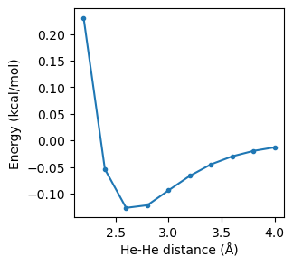

Worked Example
--------------

Initial Imports
~~~~~~~~~~~~~~~

.. code:: ipython3

   import numpy as np
   from scm.plams import Settings, Molecule, Atom, AMSJob, init

   # this line is not required in AMS2025+
   init()

::

   PLAMS working folder: /path/plams/examples/He2DissociationCurve/plams_workdir

Setup Dimer
~~~~~~~~~~~

Create Helium atoms and an array of interatomic distances at which to run calculation.

.. code:: ipython3

   # type of atoms
   atom1 = "He"
   atom2 = "He"

.. code:: ipython3

   # interatomic distance values
   dmin = 2.2
   dmax = 4.2
   step = 0.2

.. code:: ipython3

   # create a list with interatomic distances
   distances = np.arange(dmin, dmax, step)
   print(distances)

::

   [2.2 2.4 2.6 2.8 3.  3.2 3.4 3.6 3.8 4. ]

Calculation Settings
~~~~~~~~~~~~~~~~~~~~

The calculation settins are stored in a ``Settings`` object.

.. code:: ipython3

   # calculation parameters (single point, TZP/PBE+GrimmeD3)
   sett = Settings()
   sett.input.ams.task = "SinglePoint"
   sett.input.adf.basis.type = "TZP"
   sett.input.adf.xc.gga = "PBE"
   sett.input.adf.xc.dispersion = "Grimme3"

Create and Run Jobs
~~~~~~~~~~~~~~~~~~~

For each interatomic distance, create a Helium dimer molecule with the required geometry then the single point energy calculation job. Run the job and extract the energy.

.. code:: ipython3

   energies = []
   for d in distances:
       mol = Molecule()
       mol.add_atom(Atom(symbol=atom1, coords=(0.0, 0.0, 0.0)))
       mol.add_atom(Atom(symbol=atom2, coords=(d, 0.0, 0.0)))
       job = AMSJob(molecule=mol, settings=sett, name=f"dist_{d:.2f}")
       job.run()
       energies.append(job.results.get_energy(unit="kcal/mol"))

::

   [10.02|15:18:00] JOB dist_2.20 STARTED
   [10.02|15:18:00] JOB dist_2.20 RUNNING
   [10.02|15:18:06] JOB dist_2.20 FINISHED
   [10.02|15:18:06] JOB dist_2.20 SUCCESSFUL
   [10.02|15:18:06] JOB dist_2.40 STARTED
   [10.02|15:18:06] JOB dist_2.40 RUNNING
   [10.02|15:18:10] JOB dist_2.40 FINISHED
   [10.02|15:18:10] JOB dist_2.40 SUCCESSFUL
   [10.02|15:18:10] JOB dist_2.60 STARTED
   [10.02|15:18:10] JOB dist_2.60 RUNNING
   ... (PLAMS log lines truncated) ...

Results
~~~~~~~

Print table of results of the distance against the calculated energy.

.. code:: ipython3

   print("== Results ==")
   print("d[A]    E[kcal/mol]")
   for d, e in zip(distances, energies):
       print(f"{d:.2f}    {e:.3f}")

::

   == Results ==
   d[A]    E[kcal/mol]
   2.20    0.230
   2.40    -0.054
   2.60    -0.127
   2.80    -0.122
   3.00    -0.094
   3.20    -0.066
   3.40    -0.045
   3.60    -0.030
   3.80    -0.020
   4.00    -0.013

.. code:: ipython3

   import matplotlib.pyplot as plt

   fig, ax = plt.subplots(figsize=(3, 3))
   ax.plot(distances, energies, ".-")
   ax.set_xlabel("He-He distance (Å)")
   ax.set_ylabel("Energy (kcal/mol)");

