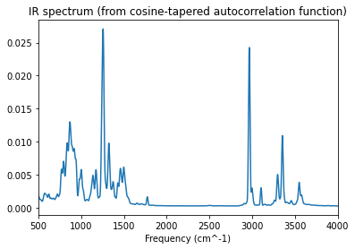

Worked Example
--------------

Initial imports
~~~~~~~~~~~~~~~

.. code:: ipython3

   import scm.plams as plams
   import matplotlib.pyplot as plt
   import numpy as np

   # this line is not required in AMS2025+
   plams.init()

Molecule
~~~~~~~~

.. code:: ipython3

   mol = plams.from_smiles("NC(CO)OCC=O")
   plams.plot_molecule(mol);

Engine settings
~~~~~~~~~~~~~~~

.. code:: ipython3

   s = plams.Settings()
   s.input.GFNFF  # GFN-FF force field
   # s.input.MLPotential.Model = "AIMNet2-wB97MD3"   # new ml model in AMS2024

   print(plams.AMSJob(settings=s).get_input())

   # run in serial
   s.runscript.nproc = 1

::

   Engine GFNFF
   EndEngine

Some general parameters
~~~~~~~~~~~~~~~~~~~~~~~

.. code:: ipython3

   T = 298  # temperature in K
   max_freq = 4000  # plot spectrum up to 4000 cm^-1
   max_dt_fs = 2000  # maximum correlation in fs for dipole derivative acf

Equilibration
~~~~~~~~~~~~~

``temperature=(500, T, T)`` means that in the first half the simulation the system is cooled from 500 K to the given temperature, and then kept constant at that temperature.

The initial temperature of 500 K does some preliminary conformer search.

.. code:: ipython3

   eq_job = plams.AMSNVTJob(
       settings=s,
       name="nvt_eq",
       molecule=mol,
       timestep=0.5,
       nsteps=10000,
       temperature=(500, T, T),
   )
   eq_job.run();

::

   [18.02|08:09:28] JOB nvt_eq STARTED
   [18.02|08:09:28] JOB nvt_eq RUNNING
   [18.02|08:09:31] JOB nvt_eq FINISHED
   [18.02|08:09:31] JOB nvt_eq SUCCESSFUL

NVE production simulation
~~~~~~~~~~~~~~~~~~~~~~~~~

The ``binlog_dipolemoment`` option stores the dipole moment at every time step.

.. code:: ipython3

   job = plams.AMSNVEJob.restart_from(
       eq_job,
       name="nve_single_prod",
       nsteps=50000,
       binlog_dipolemoment=True,
       binlog_time=True,
       samplingfreq=100,
       timestep=0.5,
   )
   job.run();

::

   [18.02|08:09:31] JOB nve_single_prod STARTED
   [18.02|08:09:31] JOB nve_single_prod RUNNING
   [18.02|08:09:48] JOB nve_single_prod FINISHED
   [18.02|08:09:48] JOB nve_single_prod SUCCESSFUL

Dipole derivative autocorrelation function
~~~~~~~~~~~~~~~~~~~~~~~~~~~~~~~~~~~~~~~~~~

.. code:: ipython3

   times, dipole_deriv_acf = job.results.get_dipole_derivatives_acf(start_fs=0, max_dt_fs=max_dt_fs)
   plt.plot(times, dipole_deriv_acf)
   plt.xlabel("Time (fs)")
   plt.ylabel("Dipole deriv. autocorrelation (e bohr / fs)^2")
   plt.title("Raw autocorrelation function");

Ideally, you should set ``max_dt_fs`` above to a large enough number so that the autocorrelation function decreases to a constant value of 0 (**and** have a long enough MD simulation to get enough statistics!)

IR spectrum
~~~~~~~~~~~

The IR spectrum is the Fourier transform of the above autocorrelation function:

.. code:: ipython3

   x_freq, y_intens_raw = job.results.get_ir_spectrum_md(times, dipole_deriv_acf, max_freq=max_freq)
   plt.plot(x_freq, y_intens_raw)
   plt.xlabel("Frequency (cm^-1)")
   plt.title("IR spectrum (from raw autocorrelation function)")
   plt.xlim(500, max_freq)
   plt.show()

There seems to be quite some “noise” in the IR spectrum. One reason for this is that there is still some signal (or noise?) in the autocorrelation function at dt = 2000 fs.

However, it’s also possible to use a tapering (window) function to make the autocorrelation function smoothly decrease to 0. This will make the resulting IR spectrum look a bit more tidy. See the next section.

Tapering function for autocorrelation function
~~~~~~~~~~~~~~~~~~~~~~~~~~~~~~~~~~~~~~~~~~~~~~

.. code:: ipython3

   def tapered_cosine(x):
       return 0.5 * (np.cos(np.pi * x / np.max(x)) + 1)

   plt.plot(times, tapered_cosine(times))
   plt.title("Tapering / cutoff / window function");

Now apply this function to the autocorrelation function:

.. code:: ipython3

   dipole_deriv_acf_tapered_cosine = dipole_deriv_acf * tapered_cosine(times)
   plt.plot(times, dipole_deriv_acf_tapered_cosine)
   plt.xlabel("Time (fs)")
   plt.title("Autocorrelation cosine tapering");

And calculate the IR spectrum:

.. code:: ipython3

   x_freq, y_intens_cosine = job.results.get_ir_spectrum_md(times, dipole_deriv_acf_tapered_cosine, max_freq=max_freq)
   plt.plot(x_freq, y_intens_cosine)
   plt.xlabel("Frequency (cm^-1)")
   plt.title("IR spectrum (from cosine-tapered autocorrelation function)")
   plt.xlim(500, max_freq);

Above we see that using the cosine-tapered autocorrelation function gives a smoother IR spectrum without affecting the intensities too much.

Compare to IR spectrum calculated from harmonic approximation
~~~~~~~~~~~~~~~~~~~~~~~~~~~~~~~~~~~~~~~~~~~~~~~~~~~~~~~~~~~~~

Let’s compare to an IR spectrum calculated with a geometry optimization + frequencies job, starting from the final frame of the MD simulation.

.. code:: ipython3

   ams_s = plams.Settings()
   ams_s.input.ams.Task = "GeometryOptimization"
   ams_s.input.ams.Properties.NormalModes = "Yes"
   harmonic_mol = job.results.get_main_molecule()
   harmonic_job = plams.AMSJob(settings=ams_s + s, name="harmonic", molecule=harmonic_mol)
   harmonic_job.run();

::

   [18.02|08:09:49] JOB harmonic STARTED
   [18.02|08:09:49] JOB harmonic RUNNING
   [18.02|08:09:49] JOB harmonic FINISHED
   [18.02|08:09:49] JOB harmonic SUCCESSFUL

.. code:: ipython3

   harmonic_freq, harmonic_intens = harmonic_job.results.get_ir_spectrum(broadening_type="lorentzian", broadening_width=20)
   plt.plot(harmonic_freq, harmonic_intens)
   rescale_factor = np.sum(harmonic_intens) / np.sum(y_intens_cosine)
   plt.plot(x_freq, y_intens_cosine * rescale_factor)  # rescale
   plt.legend(["Harmonic", "MD NVE"])
   plt.title("IR spectrum")
   plt.xlabel("Frequency (cm^-1)")
   plt.xlim(500, max_freq);

In this case, the MD simulation samples multiple conformers so there are more peaks than for the harmonic calculation.

For example, the peak for the MD at 3600 cm^-1 corresponds to the “free” OH stretch of the hydroxyl group, but in conformer used for the harmonic approximation the hydroxyl donates a hydrogen bond to the aldehyde oxygen (giving a lower vibrational frequency):

.. code:: ipython3

   plams.plot_molecule(harmonic_job.results.get_main_molecule());

View the trajectory in AMSmovie
~~~~~~~~~~~~~~~~~~~~~~~~~~~~~~~

.. code:: ipython3

   !amsmovie "{job.results.rkfpath()}"

View the normal modes in AMSspectra
~~~~~~~~~~~~~~~~~~~~~~~~~~~~~~~~~~~

.. code:: ipython3

   !amsspectra "{harmonic_job.results.rkfpath(file='engine')}"

Appendix: Average over multiple short NVE simulations
~~~~~~~~~~~~~~~~~~~~~~~~~~~~~~~~~~~~~~~~~~~~~~~~~~~~~

Best practice is to run multiple NVE simulations starting from different points of the NVT simulation, assuming that the NVT simulation samples the correct equilibrium distribution of structures/conformers.

Let’s make this more explicit with another NVT simulation, followed by multiple NVE simulations from different points of the NVT simulation. See also the “Molecular Dynamics with Python” tutorial.

.. code:: ipython3

   nvt_prod_job = plams.AMSNVTJob.restart_from(
       eq_job,
       name="nvt_prod",
       nsteps=50000,
       samplingfreq=100,
       timestep=0.5,
       thermostat="NHC",
       tau=100,
       temperature=T,
   )
   nvt_prod_job.run();

::

   [18.02|08:10:03] JOB nvt_prod STARTED
   [18.02|08:10:03] JOB nvt_prod RUNNING
   [18.02|08:10:18] JOB nvt_prod FINISHED
   [18.02|08:10:18] JOB nvt_prod SUCCESSFUL

.. code:: ipython3

   nvespawner_job = plams.AMSNVESpawnerJob(
       nvt_prod_job,
       name="nvespawner-" + nvt_prod_job.name,
       n_nve=10,  # the number of NVE simulations to run
       timestep=0.5,
       binlog_time=True,
       binlog_dipolemoment=True,
       nsteps=20000,
   )
   nvespawner_job.run();

::

   [18.02|08:10:18] JOB nvespawner-nvt_prod STARTED
   [18.02|08:10:18] JOB nvespawner-nvt_prod RUNNING
   [18.02|08:10:18] JOB nvespawner-nvt_prod/nve1 STARTED
   [18.02|08:10:18] JOB nvespawner-nvt_prod/nve1 RUNNING
   [18.02|08:10:25] JOB nvespawner-nvt_prod/nve1 FINISHED
   [18.02|08:10:25] JOB nvespawner-nvt_prod/nve1 SUCCESSFUL
   [18.02|08:10:25] JOB nvespawner-nvt_prod/nve2 STARTED
   [18.02|08:10:25] JOB nvespawner-nvt_prod/nve2 RUNNING
   [18.02|08:10:31] JOB nvespawner-nvt_prod/nve2 FINISHED
   [18.02|08:10:32] JOB nvespawner-nvt_prod/nve2 SUCCESSFUL
   ... (PLAMS log lines truncated) ...

Let’s check that the temperature during the NVE is not too far from the requested temperature.

.. code:: ipython3

   avg_T = nvespawner_job.results.get_mean_temperature()

   print(f"Set temperature during NVT: {T:.1f} K")
   print(f"Mean temperature during NVE: {avg_T:.1f}")

::

   Set temperature during NVT: 298.0 K
   Mean temperature during NVE: 277.8

Calculate the average dipole derivative autocorrelation function.

To calculate the IR spectrum from our custom set of averaged data, we directly call the ``power_spectrum`` function from PLAMS:

.. code:: ipython3

   avg_x, avg_y = nvespawner_job.results.get_dipole_derivatives_acf(start_fs=0, max_dt_fs=max_dt_fs)
   avg_y *= tapered_cosine(avg_x)

   x_freq_multiple, y_intens_cosine_multiple = plams.trajectories.analysis.power_spectrum(times, avg_y, max_freq=max_freq)

.. code:: ipython3

   plt.plot(x_freq, y_intens_cosine)
   plt.plot(x_freq_multiple, y_intens_cosine_multiple)
   plt.xlabel("Frequency (cm^-1)")
   plt.title("IR spectrum from multiple NVE simulations")
   plt.legend(["single", "multiple"])
   plt.xlim(500, 4000);

