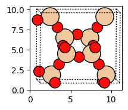

Worked Example
--------------

Complete guide to storing and converting PLAMS Molecules between Python libraries and file formats
~~~~~~~~~~~~~~~~~~~~~~~~~~~~~~~~~~~~~~~~~~~~~~~~~~~~~~~~~~~~~~~~~~~~~~~~~~~~~~~~~~~~~~~~~~~~~~~~~~

.. code:: ipython3

    import os
    from os.path import expandvars
    from pathlib import Path
    
    # make sure to source amsbashrc.sh before launching this example so that
    # the AMSHOME environment variable is set.
    
    AMSHOME = os.environ["AMSHOME"]
    cif_file = f"{AMSHOME}/atomicdata/Molecules/IZA-Zeolites/ABW.cif"
    xyz_file = f"{AMSHOME}/scripting/scm/params/examples/benchmark/ISOL6/e_13.xyz"
    
    assert Path(cif_file).exists(), f"{cif_file} does not exist."
    assert Path(xyz_file).exists(), f"{xyz_file} does not exist."
    
    
    def head(filename, n: int = 4):
        """Print the first ``n`` lines of a file"""
        with open(filename, "r") as f:
            lines = f.readlines()
            lines = lines[: min(n, len(lines))]
        print("".join(lines))

SMILES
~~~~~~

Load PLAMS Molecule from SMILES string
^^^^^^^^^^^^^^^^^^^^^^^^^^^^^^^^^^^^^^

.. code:: ipython3

    from scm.plams import from_smiles, Molecule, plot_molecule
    
    mol = from_smiles("CCCCO")
    print(f"{type(mol)=}")
    plot_molecule(mol);

.. parsed-literal::

    type(mol)=<class 'scm.plams.mol.molecule.Molecule'>

Convert PLAMS Molecule to SMILES string
^^^^^^^^^^^^^^^^^^^^^^^^^^^^^^^^^^^^^^^

Note: This requires that bonds are defined in the PLAMS Molecule.

.. code:: ipython3

    from scm.plams import to_smiles
    
    smiles = to_smiles(mol)
    print(smiles)

.. parsed-literal::

    CCCCO

.xyz files
~~~~~~~~~~

Load PLAMS Molecule from .xyz file
^^^^^^^^^^^^^^^^^^^^^^^^^^^^^^^^^^

.. code:: ipython3

    from scm.plams import Molecule, plot_molecule
    
    mol = Molecule(xyz_file)
    print(f"{type(mol)=}")
    plot_molecule(mol);

.. parsed-literal::

    type(mol)=<class 'scm.plams.mol.molecule.Molecule'>

.. image:: MoleculeFormats_files/MoleculeFormats_9_1.png

Write PLAMS Molecule to .xyz file
^^^^^^^^^^^^^^^^^^^^^^^^^^^^^^^^^

.. code:: ipython3

    mol.properties.comment = "The comment line (2nd line after the number of atoms)"
    mol.write("out.xyz")

.. code:: ipython3

    head("out.xyz")

.. parsed-literal::

    26
    The comment line (2nd line after the number of atoms)
             C      -1.47627000      -1.15316000      -0.29279600
             C      -2.86892000      -1.15881000      -0.29469200
    

.cif files
~~~~~~~~~~

Load PLAMS Molecule from .cif file
^^^^^^^^^^^^^^^^^^^^^^^^^^^^^^^^^^

PLAMS cannot natively read .cif files. Instead, go through another
library, for example ASE or pymatgen.

.. code:: ipython3

    from ase.io import read
    from scm.plams import fromASE
    
    mol: Molecule = fromASE(read(cif_file))
    print(f"{type(mol)=}")
    plot_molecule(mol);

.. parsed-literal::

    type(mol)=<class 'scm.plams.mol.molecule.Molecule'>

.. parsed-literal::

    /home/user/adfhome/bin/python3.8/lib/python3.8/site-packages/ase/io/cif.py:401: UserWarning: crystal system 'orthorhombic' is not interpreted for space group Spacegroup(74, setting=1). This may result in wrong setting!
      warnings.warn(

.. image:: MoleculeFormats_files/MoleculeFormats_15_2.png

Write PLAMS Molecule to .cif file
^^^^^^^^^^^^^^^^^^^^^^^^^^^^^^^^^

PLAMS cannot natively export to .cif files. Instead, go through another
library, for example ASE or pymatgen.

ASE can be used to write many file formats. See
https://wiki.fysik.dtu.dk/ase/ase/io/io.html

.. code:: ipython3

    from scm.plams import toASE
    
    toASE(mol).write("out.cif")
    head("out.cif")

.. parsed-literal::

    data_image0
    _chemical_formula_structural       O16Si8
    _chemical_formula_sum              "O16 Si8"
    _cell_length_a       9.873
    

AMS .in system block format
~~~~~~~~~~~~~~~~~~~~~~~~~~~

Write PLAMS Molecule to AMS .in system file
^^^^^^^^^^^^^^^^^^^^^^^^^^^^^^^^^^^^^^^^^^^

.. code:: ipython3

    mol.write("ams_system_block.in")
    head("ams_system_block.in")

.. parsed-literal::

    System
      Atoms
                  O       4.9365000000       1.3135000000       3.0896710000
                  O       0.0000000000       3.9405000000       7.4746710000
    

Load PLAMS Molecule from AMS .in system file
^^^^^^^^^^^^^^^^^^^^^^^^^^^^^^^^^^^^^^^^^^^^

.. code:: ipython3

    from scm.plams import Molecule
    
    mol = Molecule("ams_system_block.in")
    plot_molecule(mol);

POSCAR/CONTCAR (VASP input format)
~~~~~~~~~~~~~~~~~~~~~~~~~~~~~~~~~~

Write PLAMS Molecule to POSCAR/CONTCAR (VASP input format)
^^^^^^^^^^^^^^^^^^^^^^^^^^^^^^^^^^^^^^^^^^^^^^^^^^^^^^^^^^

ASE can be used to write many file formats. See
https://wiki.fysik.dtu.dk/ase/ase/io/io.html

.. code:: ipython3

    from scm.plams import toASE
    
    toASE(mol).write("POSCAR")
    head("POSCAR", 10)

.. parsed-literal::

     O Si 
     1.0000000000000000
         9.8729999999999993    0.0000000000000000    0.0000000000000000
         0.0000000000000000    5.2539999999999996    0.0000000000000000
         0.0000000000000000    0.0000000000000000    8.7699999999999996
     O   Si 
      16   8
    Cartesian
      4.9364999999999997  1.3134999999999999  3.0896710000000001
      0.0000000000000000  3.9405000000000001  7.4746709999999998
    

Load PLAMS Molecule from POSCAR/CONTCAR (VASP input format)
^^^^^^^^^^^^^^^^^^^^^^^^^^^^^^^^^^^^^^^^^^^^^^^^^^^^^^^^^^^

.. code:: ipython3

    from scm.plams import fromASE
    from ase.io import read
    
    mol: Molecule = fromASE(read("POSCAR"))
    
    print(f"{type(mol)=}")
    plot_molecule(mol);

.. parsed-literal::

    type(mol)=<class 'scm.plams.mol.molecule.Molecule'>

.. image:: MoleculeFormats_files/MoleculeFormats_26_1.png

ASE Atoms Python class
~~~~~~~~~~~~~~~~~~~~~~

Convert PLAMS Molecule to ASE Atoms
^^^^^^^^^^^^^^^^^^^^^^^^^^^^^^^^^^^

.. code:: ipython3

    from scm.plams import toASE
    from ase import Atoms
    from ase.visualize.plot import plot_atoms
    
    print(f"{type(mol)=}")
    print(f"{mol.get_formula()=}")
    
    ase_atoms: Atoms = toASE(mol)
    print(f"{type(ase_atoms)=}")
    print(f"{ase_atoms.get_chemical_formula()=}")
    
    plot_atoms(ase_atoms, rotation="-85x,5y,0z");

.. parsed-literal::

    type(mol)=<class 'scm.plams.mol.molecule.Molecule'>
    mol.get_formula()='O16Si8'
    type(ase_atoms)=<class 'ase.atoms.Atoms'>
    ase_atoms.get_chemical_formula()='O16Si8'

Convert ASE Atoms to PLAMS Molecule
^^^^^^^^^^^^^^^^^^^^^^^^^^^^^^^^^^^

.. code:: ipython3

    from scm.plams import fromASE, plot_molecule, Molecule
    
    mol: Molecule = fromASE(ase_atoms)
    print(f"{type(mol)=}")
    plot_molecule(mol, rotation="-85x,5y,0z");

.. parsed-literal::

    type(mol)=<class 'scm.plams.mol.molecule.Molecule'>

RDKit Mol Python class
~~~~~~~~~~~~~~~~~~~~~~

Convert PLAMS Molecule to RDKit Mol
^^^^^^^^^^^^^^^^^^^^^^^^^^^^^^^^^^^

.. code:: ipython3

    from scm.plams import to_rdmol, Molecule
    from rdkit.Chem import Draw
    from rdkit.Chem.Draw import IPythonConsole
    
    IPythonConsole.ipython_useSVG = True
    IPythonConsole.molSize = 250, 250
    
    plams_mol = Molecule(xyz_file)
    # guess bonds, the bonds will be included in the RDKit molecule
    plams_mol.guess_bonds()
    
    rdkit_mol = to_rdmol(plams_mol)
    print(f"{type(rdkit_mol)=}")
    rdkit_mol

.. parsed-literal::

    type(rdkit_mol)=<class 'rdkit.Chem.rdchem.Mol'>

Convert RDKit Mol to PLAMS Molecule
^^^^^^^^^^^^^^^^^^^^^^^^^^^^^^^^^^^

.. code:: ipython3

    from scm.plams import from_rdmol, plot_molecule, Molecule
    
    mol: Molecule = from_rdmol(rdkit_mol)
    
    print(f"{type(rdkit_mol)=}")
    print(f"{type(mol)=}")
    plot_molecule(mol);

.. parsed-literal::

    type(rdkit_mol)=<class 'rdkit.Chem.rdchem.Mol'>
    type(mol)=<class 'scm.plams.mol.molecule.Molecule'>

SCM libbase UnifiedChemicalSystem Python class
~~~~~~~~~~~~~~~~~~~~~~~~~~~~~~~~~~~~~~~~~~~~~~

Convert PLAMS Molecule to UnifiedChemicalSystem
^^^^^^^^^^^^^^^^^^^^^^^^^^^^^^^^^^^^^^^^^^^^^^^

.. code:: ipython3

    from scm.utils.conversions import plams_molecule_to_chemsys, chemsys_to_plams_molecule
    from scm.plams import Molecule
    from scm.libbase import UnifiedChemicalSystem
    
    mol = Molecule(xyz_file)
    chemsys = plams_molecule_to_chemsys(mol)
    print(f"{type(chemsys)=}")
    print(chemsys)

.. parsed-literal::

    type(chemsys)=<class 'scm_libbase_internal.UnifiedChemicalSystem'>
    System
       Atoms
          C   -1.4762700000000000 -1.1531600000000000 -0.2927960000000000
          C   -2.8689200000000001 -1.1588099999999999 -0.2946920000000000
          C   -3.5922599999999996  0.0018495600000000  0.0382389000000000
          C   -2.8682400000000001  1.1615899999999997  0.3732800000000000
          C   -1.4756899999999997  1.1545000000000001  0.3733980000000000
          C   -0.7393110000000001  0.0002348960000000  0.0410634000000000
          C    1.4762700000000000  1.1531600000000000 -0.2927960000000000
          C    0.7393110000000001 -0.0002348960000000  0.0410634000000000
          C    1.4756899999999997 -1.1545000000000001  0.3733980000000000
          C    2.8682400000000001 -1.1615899999999997  0.3732800000000000
          C    3.5922599999999996 -0.0018495600000000  0.0382389000000000
          C    2.8689200000000001  1.1588099999999999 -0.2946920000000000
          N    4.9909600000000003  0.0138526000000000  0.0923716000000000
          N   -4.9909600000000003 -0.0138526000000000  0.0923716000000000
          H   -0.9455750000000001 -2.0578500000000002 -0.5825910000000000
          H   -3.4077600000000001 -2.0665900000000001 -0.5655390000000000
          H   -3.4066700000000001  2.0680399999999999  0.6490430000000000
          H   -0.9444339999999999  2.0599200000000000  0.6597379999999999
          H    0.9455750000000001  2.0578500000000002 -0.5825910000000000
          H    0.9444339999999999 -2.0599200000000000  0.6597379999999999
          H    3.4066700000000001 -2.0680399999999999  0.6490430000000000
          H    3.4077600000000001  2.0665900000000001 -0.5655390000000000
          H    5.4353400000000001 -0.8878359999999998 -0.0246370000000000
          H    5.4345399999999993  0.7312659999999999 -0.4668780000000000
          H   -5.4345399999999993 -0.7312659999999999 -0.4668780000000000
          H   -5.4353400000000001  0.8878359999999998 -0.0246370000000000
       End
    End

Convert UnifiedChemicalSystem to PLAMS Molecule
^^^^^^^^^^^^^^^^^^^^^^^^^^^^^^^^^^^^^^^^^^^^^^^

.. code:: ipython3

    from scm.utils.conversions import plams_molecule_to_chemsys, chemsys_to_plams_molecule
    from scm.plams import Molecule
    from scm.libbase import UnifiedChemicalSystem
    
    mol = chemsys_to_plams_molecule(chemsys)
    print(f"{type(chemsys)=}")
    print(f"{type(mol)=}")
    plot_molecule(mol);

.. parsed-literal::

    type(chemsys)=<class 'scm_libbase_internal.UnifiedChemicalSystem'>
    type(mol)=<class 'scm.plams.mol.molecule.Molecule'>

.. image:: MoleculeFormats_files/MoleculeFormats_40_1.png

pymatgen Structure and Molecule Python classes
~~~~~~~~~~~~~~~~~~~~~~~~~~~~~~~~~~~~~~~~~~~~~~

Convert PLAMS Molecule to pymatgen Structure (periodic)
^^^^^^^^^^^^^^^^^^^^^^^^^^^^^^^^^^^^^^^^^^^^^^^^^^^^^^^

There is no builtin converter between PLAMS Molecule and pymatgen
Structure (periodic crystal). Instead, you need to go through the ASE
interface to both packages:

.. code:: ipython3

    from pymatgen.core.structure import Structure
    from pymatgen.io.ase import AseAtomsAdaptor
    import scm.plams
    from scm.plams import fromASE, toASE, Molecule
    from ase.io import read
    
    
    def convert_plams_molecule_to_pymatgen_structure(mol: Molecule) -> Structure:
        return AseAtomsAdaptor().get_structure(toASE(mol))
    
    
    mol: scm.plams.Molecule = fromASE(read(cif_file))
    
    pymatgen_structure: Structure = convert_plams_molecule_to_pymatgen_structure(mol)
    
    print(f"{type(mol)=}")
    print(f"{type(pymatgen_structure)=}")
    print(pymatgen_structure)

.. parsed-literal::

    type(mol)=<class 'scm.plams.mol.molecule.Molecule'>
    type(pymatgen_structure)=<class 'pymatgen.core.structure.Structure'>
    Full Formula (Si8 O16)
    Reduced Formula: SiO2
    abc   :   9.873000   5.254000   8.770000
    angles:  90.000000  90.000000  90.000000
    pbc   :       True       True       True
    Sites (24)
      #  SP         a     b       c
    ---  ----  ------  ----  ------
      0  O     0.5     0.25  0.3523
      1  O     0       0.75  0.8523
      2  O     0.5     0.75  0.6477
      3  O     0       0.25  0.1477
      4  O     0.31    0     0.5
      5  O     0.81    0.5   0
      6  O     0.69    0     0.5
      7  O     0.19    0.5   0
      8  O     0.31    0.5   0.5
      9  O     0.81    0     0
     10  O     0.69    0.5   0.5
     11  O     0.19    0     0
     12  O     0.25    0.25  0.25
     13  O     0.75    0.75  0.75
     14  O     0.75    0.25  0.25
     15  O     0.25    0.75  0.75
     16  Si    0.3428  0.25  0.4007
     17  Si    0.8428  0.75  0.9007
     18  Si    0.6572  0.25  0.4007
     19  Si    0.1572  0.75  0.9007
     20  Si    0.6572  0.75  0.5993
     21  Si    0.1572  0.25  0.0993
     22  Si    0.3428  0.75  0.5993
     23  Si    0.8428  0.25  0.0993

.. parsed-literal::

    /home/user/adfhome/bin/python3.8/lib/python3.8/site-packages/ase/io/cif.py:401: UserWarning: crystal system 'orthorhombic' is not interpreted for space group Spacegroup(74, setting=1). This may result in wrong setting!
      warnings.warn(

Convert pymatgen Structure (periodic) to PLAMS Molecule
^^^^^^^^^^^^^^^^^^^^^^^^^^^^^^^^^^^^^^^^^^^^^^^^^^^^^^^

Go through the ASE interface:

.. code:: ipython3

    from pymatgen.io.ase import AseAtomsAdaptor
    from pymatgen.core.structure import Structure
    from scm.plams import fromASE
    from scm.plams import Molecule
    
    
    def pymatgen_structure_to_plams_molecule(pymatgen_structure: Structure) -> Molecule:
        return fromASE(AseAtomsAdaptor().get_atoms(pymatgen_structure))
    
    
    print(f"{type(pymatgen_structure)=}")
    
    mol = pymatgen_structure_to_plams_molecule(pymatgen_structure)
    print(f"{type(mol)=}")

.. parsed-literal::

    type(pymatgen_structure)=<class 'pymatgen.core.structure.Structure'>
    type(mol)=<class 'scm.plams.mol.molecule.Molecule'>

Convert PLAMS Molecule to pymatgen Molecule (non-periodic)
^^^^^^^^^^^^^^^^^^^^^^^^^^^^^^^^^^^^^^^^^^^^^^^^^^^^^^^^^^

pymatgen has a special ``Molecule`` class for non-periodic systems. In
PLAMS, the ``Molecule`` class is used for both periodic and non-periodic
systems.

.. code:: ipython3

    import pymatgen.core.structure
    import scm.plams
    from pymatgen.io.ase import AseAtomsAdaptor
    from scm.plams import toASE
    
    
    def convert_plams_molecule_to_pymatgen_molecule(
        mol: scm.plams.Molecule,
    ) -> pymatgen.core.structure.Molecule:
        return AseAtomsAdaptor().get_molecule(toASE(mol))
    
    
    plams_molecule = scm.plams.Molecule(xyz_file)
    
    pymatgen_molecule: pymatgen.core.structure.Molecule = convert_plams_molecule_to_pymatgen_molecule(plams_molecule)
    
    print(f"{type(plams_molecule)=}")
    print(f"{type(pymatgen_molecule)=}")
    print(pymatgen_molecule)

.. parsed-literal::

    type(plams_molecule)=<class 'scm.plams.mol.molecule.Molecule'>
    type(pymatgen_molecule)=<class 'pymatgen.core.structure.Molecule'>
    Full Formula (H12 C12 N2)
    Reduced Formula: H6C6N
    Charge = 0, Spin Mult = 1
    Sites (26)
    0 C    -1.476270    -1.153160    -0.292796
    1 C    -2.868920    -1.158810    -0.294692
    2 C    -3.592260     0.001850     0.038239
    3 C    -2.868240     1.161590     0.373280
    4 C    -1.475690     1.154500     0.373398
    5 C    -0.739311     0.000235     0.041063
    6 C     1.476270     1.153160    -0.292796
    7 C     0.739311    -0.000235     0.041063
    8 C     1.475690    -1.154500     0.373398
    9 C     2.868240    -1.161590     0.373280
    10 C     3.592260    -0.001850     0.038239
    11 C     2.868920     1.158810    -0.294692
    12 N     4.990960     0.013853     0.092372
    13 N    -4.990960    -0.013853     0.092372
    14 H    -0.945575    -2.057850    -0.582591
    15 H    -3.407760    -2.066590    -0.565539
    16 H    -3.406670     2.068040     0.649043
    17 H    -0.944434     2.059920     0.659738
    18 H     0.945575     2.057850    -0.582591
    19 H     0.944434    -2.059920     0.659738
    20 H     3.406670    -2.068040     0.649043
    21 H     3.407760     2.066590    -0.565539
    22 H     5.435340    -0.887836    -0.024637
    23 H     5.434540     0.731266    -0.466878
    24 H    -5.434540    -0.731266    -0.466878
    25 H    -5.435340     0.887836    -0.024637

Convert pymatgen Molecule (non-periodic) to PLAMS Molecule
^^^^^^^^^^^^^^^^^^^^^^^^^^^^^^^^^^^^^^^^^^^^^^^^^^^^^^^^^^

.. code:: ipython3

    from pymatgen.io.ase import AseAtomsAdaptor
    import pymatgen.core.structure
    from scm.plams import fromASE
    from scm.plams import Molecule
    
    
    def pymatgen_molecule_to_plams_molecule(
        pymatgen_molecule: pymatgen.core.structure.Molecule,
    ) -> scm.plams.Molecule:
        return fromASE(AseAtomsAdaptor().get_atoms(pymatgen_molecule))
    
    
    print(f"{type(pymatgen_molecule)=}")
    
    mol = pymatgen_molecule_to_plams_molecule(pymatgen_molecule)
    print(f"{type(mol)=}")
    plot_molecule(mol);

.. parsed-literal::

    type(pymatgen_molecule)=<class 'pymatgen.core.structure.Molecule'>
    type(mol)=<class 'scm.plams.mol.molecule.Molecule'>

.. image:: MoleculeFormats_files/MoleculeFormats_49_1.png

