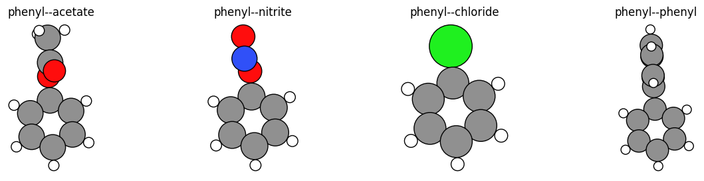

.. _MoleculeSubstitutionExample:

Molecule substitution: Attach ligands to substrates
=============================================================

.. image:: MoleculeSubstitution_files/MoleculeSubstitution_22_0.svg

Script showing how to created substituted benzene molecules using PLAMS, by
combining a benzene molecule with a different molecule and defining one bond on
each molecule (the "connector") to break and where a new bond will be formed.

.. seealso::

    * :ref:`ExcitationsWorkflowExample`
    * :ref:`Molecule`
    * :ref:`AMSTSWorkflowExample`

**Note**: This example requires AMS2023 or later.

.. include:: MoleculeSubstitution.common_header.rst
.. include:: MoleculeSubstitution.ipynb.rst
.. include:: MoleculeSubstitution.common_footer.rst