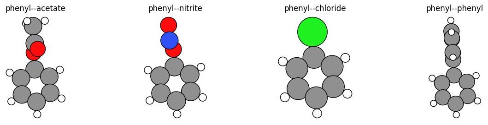
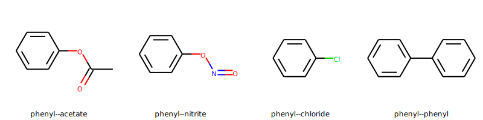

.. _MoleculeSubstitutionExample:
.. _MoleculeSubstitution:

Molecule substitution: Attach ligands to substrates
=============================================================

Script showing how to created substituted benzene molecules using PLAMS, by
combining a benzene molecule with a different molecule and defining one bond on
each molecule (the "connector") to break and where a new bond will be formed.

.. seealso::

    * :ref:`ExcitationsWorkflow`
    * :ref:`Molecule`
    * :ref:`AMSTSWorkflow`

**Note**: This example requires AMS2023 or later.

To follow along, either

* Download :download:`MoleculeSubstitution.py <../../../../examples/MoleculeSubstitution.py>` (run as ``$AMSBIN/amspython MoleculeSubstitution.py``).
* Download :download:`MoleculeSubstitution.ipynb` (see also: how to install `Jupyterlab <../../../Scripting/Python_Stack/Python_Stack.html#install-and-run-jupyter-lab-jupyter-notebooks>`__ in AMS)

.. include:: MoleculeSubstitution.rst.include

Complete Python code
----------------------------

.. literalinclude:: MoleculeSubstitution.py
    :language: python
