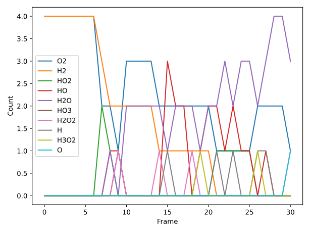
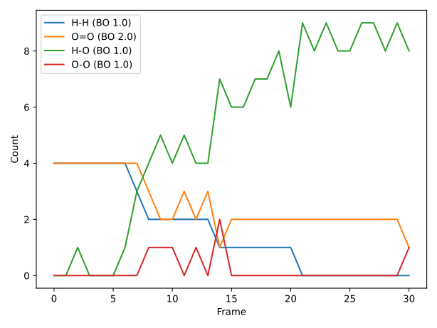

.. _MoleculesTable:

Table molecule counts and bond count from reactive MD ams.rkf
=============================================================

If you run a reactive molecular dynamics simulation with for example ReaxFF, you may want to see how the number of molecules of different types changes with time.

It is also interesting to follow the number of bonds of a given type.
A bond type is characterized by two elements making the bond and the order of the bond.
The bond order is a real number and rounding off the value provides an indictation of the type of the bond.
Rounding off the bond order to the next integer value gives 1, 2, 3, corresponding to single, double, triple bonds, respectively.
Rounding off the bond order to half-integer values gives some additional details to the bond type.
You can edit the ``round_type`` variable to either integer or half-integer.

Run the below script providing the ams.rkf file as the first (and only) command-line argument. If no ams.rkf file is given, a short MD simulation is run with ReaxFF to illustrate the analysis.

**Example usage:** (:download:`Download MoleculesTable.py <../../../examples/MoleculesTable.py>`)

.. literalinclude:: ../../../examples/MoleculesTable.py
	:language: python

