Worked Example
--------------

Initial imports
~~~~~~~~~~~~~~~

.. code:: ipython3

    from scm.plams import plot_molecule, from_smiles, Molecule
    from scm.plams.interfaces.molecule.packmol import packmol, packmol_around
    from ase.visualize.plot import plot_atoms
    from ase.build import fcc111, bulk
    import matplotlib.pyplot as plt

Helper functions
~~~~~~~~~~~~~~~~

.. code:: ipython3

    def printsummary(mol, details=None):
        if details:
            density = details["density"]
        else:
            density = mol.get_density() * 1e-3
        s = f"{len(mol)} atoms, density = {density:.3f} g/cm^3"
        if mol.lattice:
            s += f", box = {mol.lattice[0][0]:.3f}, {mol.lattice[1][1]:.3f}, {mol.lattice[2][2]:.3f}"
        s += f", formula = {mol.get_formula()}"
        if details:
            s += f'\n#added molecules per species: {details["n_molecules"]}, mole fractions: {details["mole_fractions"]}'
        print(s)

Liquid water (fluid with 1 component)
~~~~~~~~~~~~~~~~~~~~~~~~~~~~~~~~~~~~~

First, create the gasphase molecule:

.. code:: ipython3

    water = from_smiles("O")
    plot_molecule(water);

.. code:: ipython3

    print("pure liquid from approximate number of atoms and exact density (in g/cm^3), cubic box with auto-determined size")
    out = packmol(water, n_atoms=194, density=1.0)
    printsummary(out)
    out.write("water-1.xyz")
    plot_molecule(out);

.. parsed-literal::

    pure liquid from approximate number of atoms and exact density (in g/cm^3), cubic box with auto-determined size
    195 atoms, density = 1.000 g/cm^3, box = 12.482, 12.482, 12.482, formula = H130O65

.. image:: PackMol_files/PackMol_6_1.png

.. code:: ipython3

    print("pure liquid from approximate density (in g/cm^3) and an orthorhombic box")
    out = packmol(water, density=1.0, box_bounds=[0.0, 0.0, 0.0, 8.0, 12.0, 14.0])
    printsummary(out)
    out.write("water-2.xyz")
    plot_molecule(out);

.. parsed-literal::

    pure liquid from approximate density (in g/cm^3) and an orthorhombic box
    135 atoms, density = 1.002 g/cm^3, box = 8.000, 12.000, 14.000, formula = H90O45

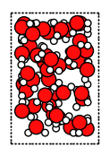

.. code:: ipython3

    print("pure liquid with explicit number of molecules and exact density")
    out = packmol(water, n_molecules=64, density=1.0)
    printsummary(out)
    out.write("water-3.xyz")
    plot_molecule(out);

.. parsed-literal::

    pure liquid with explicit number of molecules and exact density
    192 atoms, density = 1.000 g/cm^3, box = 12.417, 12.417, 12.417, formula = H128O64

.. image:: PackMol_files/PackMol_8_1.png

.. code:: ipython3

    print("pure liquid with explicit number of molecules and box")
    out = packmol(water, n_molecules=64, box_bounds=[0.0, 0.0, 0.0, 12.0, 13.0, 14.0])
    printsummary(out)
    out.write("water-4.xyz")
    plot_molecule(out);

.. parsed-literal::

    pure liquid with explicit number of molecules and box
    192 atoms, density = 0.877 g/cm^3, box = 12.000, 13.000, 14.000, formula = H128O64

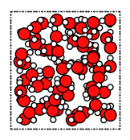

.. code:: ipython3

    print("water-5.xyz: pure liquid in non-orthorhombic box (requires AMS2025 or later)")
    # Non-orthorhombic boxes use UFF MD simulations behind the scenes
    # You can pack inside any lattice using the packmol_around function
    
    box = Molecule()
    box.lattice = [[10.0, 2.0, -1.0], [-5.0, 8.0, 0.0], [0.0, -2.0, 11.0]]
    out = packmol_around(box, molecules=[water], n_molecules=[32])
    out.write("water-5.xyz")
    plot_molecule(out);

.. parsed-literal::

    water-5.xyz: pure liquid in non-orthorhombic box (requires AMS2025 or later)

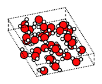

.. code:: ipython3

    print("Experimental feature (AMS2025): guess density for pure liquid")
    print("Note: This density is meant to be equilibrated with NPT MD. It can be very inaccurate!")
    out = packmol(water, n_atoms=100)
    print(f"Guessed density: {out.get_density():.2f} kg/m^3")
    plot_molecule(out);

.. parsed-literal::

    Experimental feature (AMS2025): guess density for pure liquid
    Note: This density is meant to be equilibrated with NPT MD. It can be very inaccurate!
    Guessed density: 1139.23 kg/m^3

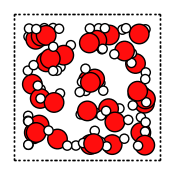

Water-acetonitrile mixture (fluid with 2 or more components)
~~~~~~~~~~~~~~~~~~~~~~~~~~~~~~~~~~~~~~~~~~~~~~~~~~~~~~~~~~~~

Let’s also create a single acetonitrile molecule:

.. code:: ipython3

    acetonitrile = from_smiles("CC#N")
    plot_molecule(acetonitrile);

Set the desired mole fractions and density. Here, the density is
calculated as the weighted average of water (1.0 g/cm^3) and
acetonitrile (0.76 g/cm^3) densities, but you could use any other
density.

.. code:: ipython3

    # MIXTURES
    x_water = 0.666  # mole fraction
    x_acetonitrile = 1 - x_water  # mole fraction
    # weighted average of pure component densities
    density = (x_water * 1.0 + x_acetonitrile * 0.76) / (x_water + x_acetonitrile)
    
    print("MIXTURES")
    print(f"x_water = {x_water:.3f}")
    print(f"x_acetonitrile = {x_acetonitrile:.3f}")
    print(f"target density = {density:.3f} g/cm^3")

.. parsed-literal::

    MIXTURES
    x_water = 0.666
    x_acetonitrile = 0.334
    target density = 0.920 g/cm^3

By setting ``return_details=True``, you can get information about the
mole fractions of the returned system. They may not exactly match the
mole fractions you put in.

.. code:: ipython3

    print(
        "2-1 water-acetonitrile from approximate number of atoms and exact density (in g/cm^3), "
        "cubic box with auto-determined size"
    )
    out, details = packmol(
        molecules=[water, acetonitrile],
        mole_fractions=[x_water, x_acetonitrile],
        n_atoms=200,
        density=density,
        return_details=True,
    )
    printsummary(out, details)
    out.write("water-acetonitrile-1.xyz")
    plot_molecule(out);

.. parsed-literal::

    2-1 water-acetonitrile from approximate number of atoms and exact density (in g/cm^3), cubic box with auto-determined size
    201 atoms, density = 0.920 g/cm^3, box = 13.263, 13.263, 13.263, formula = C34H117N17O33
    #added molecules per species: [33, 17], mole fractions: [0.66, 0.34]

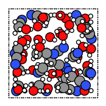

The ``details`` is a dictionary as follows:

.. code:: ipython3

    for k, v in details.items():
        print(f"{k}: {v}")

.. parsed-literal::

    n_molecules: [33, 17]
    mole_fractions: [0.66, 0.34]
    n_atoms: 201
    molecule_type_indices: [0, 0, 0, 0, 0, 0, 0, 0, 0, 0, 0, 0, 0, 0, 0, 0, 0, 0, 0, 0, 0, 0, 0, 0, 0, 0, 0, 0, 0, 0, 0, 0, 0, 0, 0, 0, 0, 0, 0, 0, 0, 0, 0, 0, 0, 0, 0, 0, 0, 0, 0, 0, 0, 0, 0, 0, 0, 0, 0, 0, 0, 0, 0, 0, 0, 0, 0, 0, 0, 0, 0, 0, 0, 0, 0, 0, 0, 0, 0, 0, 0, 0, 0, 0, 0, 0, 0, 0, 0, 0, 0, 0, 0, 0, 0, 0, 0, 0, 0, 1, 1, 1, 1, 1, 1, 1, 1, 1, 1, 1, 1, 1, 1, 1, 1, 1, 1, 1, 1, 1, 1, 1, 1, 1, 1, 1, 1, 1, 1, 1, 1, 1, 1, 1, 1, 1, 1, 1, 1, 1, 1, 1, 1, 1, 1, 1, 1, 1, 1, 1, 1, 1, 1, 1, 1, 1, 1, 1, 1, 1, 1, 1, 1, 1, 1, 1, 1, 1, 1, 1, 1, 1, 1, 1, 1, 1, 1, 1, 1, 1, 1, 1, 1, 1, 1, 1, 1, 1, 1, 1, 1, 1, 1, 1, 1, 1, 1, 1, 1, 1, 1]
    molecule_indices: [0, 0, 0, 1, 1, 1, 2, 2, 2, 3, 3, 3, 4, 4, 4, 5, 5, 5, 6, 6, 6, 7, 7, 7, 8, 8, 8, 9, 9, 9, 10, 10, 10, 11, 11, 11, 12, 12, 12, 13, 13, 13, 14, 14, 14, 15, 15, 15, 16, 16, 16, 17, 17, 17, 18, 18, 18, 19, 19, 19, 20, 20, 20, 21, 21, 21, 22, 22, 22, 23, 23, 23, 24, 24, 24, 25, 25, 25, 26, 26, 26, 27, 27, 27, 28, 28, 28, 29, 29, 29, 30, 30, 30, 31, 31, 31, 32, 32, 32, 33, 33, 33, 33, 33, 33, 34, 34, 34, 34, 34, 34, 35, 35, 35, 35, 35, 35, 36, 36, 36, 36, 36, 36, 37, 37, 37, 37, 37, 37, 38, 38, 38, 38, 38, 38, 39, 39, 39, 39, 39, 39, 40, 40, 40, 40, 40, 40, 41, 41, 41, 41, 41, 41, 42, 42, 42, 42, 42, 42, 43, 43, 43, 43, 43, 43, 44, 44, 44, 44, 44, 44, 45, 45, 45, 45, 45, 45, 46, 46, 46, 46, 46, 46, 47, 47, 47, 47, 47, 47, 48, 48, 48, 48, 48, 48, 49, 49, 49, 49, 49, 49]
    atom_indices_in_molecule: [0, 1, 2, 0, 1, 2, 0, 1, 2, 0, 1, 2, 0, 1, 2, 0, 1, 2, 0, 1, 2, 0, 1, 2, 0, 1, 2, 0, 1, 2, 0, 1, 2, 0, 1, 2, 0, 1, 2, 0, 1, 2, 0, 1, 2, 0, 1, 2, 0, 1, 2, 0, 1, 2, 0, 1, 2, 0, 1, 2, 0, 1, 2, 0, 1, 2, 0, 1, 2, 0, 1, 2, 0, 1, 2, 0, 1, 2, 0, 1, 2, 0, 1, 2, 0, 1, 2, 0, 1, 2, 0, 1, 2, 0, 1, 2, 0, 1, 2, 0, 1, 2, 3, 4, 5, 0, 1, 2, 3, 4, 5, 0, 1, 2, 3, 4, 5, 0, 1, 2, 3, 4, 5, 0, 1, 2, 3, 4, 5, 0, 1, 2, 3, 4, 5, 0, 1, 2, 3, 4, 5, 0, 1, 2, 3, 4, 5, 0, 1, 2, 3, 4, 5, 0, 1, 2, 3, 4, 5, 0, 1, 2, 3, 4, 5, 0, 1, 2, 3, 4, 5, 0, 1, 2, 3, 4, 5, 0, 1, 2, 3, 4, 5, 0, 1, 2, 3, 4, 5, 0, 1, 2, 3, 4, 5, 0, 1, 2, 3, 4, 5]
    volume: 2333.0853879652004
    density: 0.9198400000000004

.. code:: ipython3

    print("2-1 water-acetonitrile from approximate density (in g/cm^3) and box bounds")
    out, details = packmol(
        molecules=[water, acetonitrile],
        mole_fractions=[x_water, x_acetonitrile],
        box_bounds=[0, 0, 0, 13.2, 13.2, 13.2],
        density=density,
        return_details=True,
    )
    printsummary(out, details)
    out.write("water-acetonitrile-2.xyz")
    plot_molecule(out);

.. parsed-literal::

    2-1 water-acetonitrile from approximate density (in g/cm^3) and box bounds
    201 atoms, density = 0.933 g/cm^3, box = 13.200, 13.200, 13.200, formula = C34H117N17O33
    #added molecules per species: [33, 17], mole fractions: [0.66, 0.34]

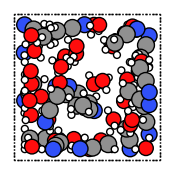

.. code:: ipython3

    print("2-1 water-acetonitrile from explicit number of molecules and density, cubic box with auto-determined size")
    out, details = packmol(
        molecules=[water, acetonitrile],
        n_molecules=[32, 16],
        density=density,
        return_details=True,
    )
    printsummary(out, details)
    out.write("water-acetonitrile-3.xyz")
    plot_molecule(out);

.. parsed-literal::

    2-1 water-acetonitrile from explicit number of molecules and density, cubic box with auto-determined size
    192 atoms, density = 0.920 g/cm^3, box = 13.058, 13.058, 13.058, formula = C32H112N16O32
    #added molecules per species: [32, 16], mole fractions: [0.6666666666666666, 0.3333333333333333]

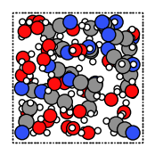

.. code:: ipython3

    print("2-1 water-acetonitrile from explicit number of molecules and box")
    out = packmol(
        molecules=[water, acetonitrile],
        n_molecules=[32, 16],
        box_bounds=[0, 0, 0, 13.2, 13.2, 13.2],
    )
    printsummary(out)
    out.write("water-acetonitrile-4.xyz")
    plot_molecule(out);

.. parsed-literal::

    2-1 water-acetonitrile from explicit number of molecules and box
    192 atoms, density = 0.890 g/cm^3, box = 13.200, 13.200, 13.200, formula = C32H112N16O32

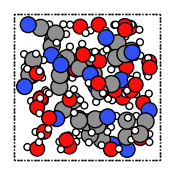

.. code:: ipython3

    print("Experimental feature (AMS2025): guess density for mixture")
    print("Note: This density is meant to be equilibrated with NPT MD. It can be very inaccurate!")
    out = packmol([water, acetonitrile], mole_fractions=[x_water, x_acetonitrile], n_atoms=100)
    print(f"Guessed density: {out.get_density():.2f} kg/m^3")
    plot_molecule(out);

.. parsed-literal::

    Experimental feature (AMS2025): guess density for mixture
    Note: This density is meant to be equilibrated with NPT MD. It can be very inaccurate!
    Guessed density: 853.04 kg/m^3

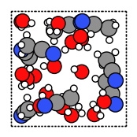

Pack inside sphere
~~~~~~~~~~~~~~~~~~

Set ``sphere=True`` to pack in a sphere (non-periodic) instead of in a
periodic box. The sphere will be centered near the origin.

.. code:: ipython3

    print("water in a sphere from exact density and number of molecules")
    out, details = packmol(molecules=[water], n_molecules=[100], density=1.0, return_details=True, sphere=True)
    printsummary(out, details)
    print(f"Radius  of sphere: {details['radius']:.3f} ang.")
    print(f"Center of mass xyz (ang): {out.get_center_of_mass()}")
    out.write("water-sphere.xyz")
    plot_molecule(out);

.. parsed-literal::

    water in a sphere from exact density and number of molecules
    300 atoms, density = 1.000 g/cm^3, formula = H200O100
    #added molecules per species: [100], mole fractions: [1.0]
    Radius  of sphere: 8.939 ang.
    Center of mass xyz (ang): (-0.4387310024277284, -0.13878223396461692, -0.24909134060025434)

.. image:: PackMol_files/PackMol_25_1.png

.. code:: ipython3

    print(
        "2-1 water-acetonitrile in a sphere from exact density (in g/cm^3) and "
        "approximate number of atoms and mole fractions"
    )
    out, details = packmol(
        molecules=[water, acetonitrile],
        mole_fractions=[x_water, x_acetonitrile],
        n_atoms=500,
        density=density,
        return_details=True,
        sphere=True,
    )
    printsummary(out, details)
    out.write("water-acetonitrile-sphere.xyz")
    plot_molecule(out);

.. parsed-literal::

    2-1 water-acetonitrile in a sphere from exact density (in g/cm^3) and approximate number of atoms and mole fractions
    501 atoms, density = 0.920 g/cm^3, formula = C84H292N42O83
    #added molecules per species: [83, 42], mole fractions: [0.664, 0.336]

.. image:: PackMol_files/PackMol_26_1.png

Packing ions, total system charge
~~~~~~~~~~~~~~~~~~~~~~~~~~~~~~~~~

The total system charge will be sum of the charges of the constituent
molecules.

In PLAMS, ``molecule.properties.charge`` specifies the charge:

.. code:: ipython3

    ammonium = from_smiles("[NH4+]")  # ammonia.properties.charge == +1
    chloride = from_smiles("[Cl-]")  # chloride.properties.charge == -1
    print("3 water molecules, 3 ammonium, 1 chloride (non-periodic)")
    print("Initial charges:")
    print(f"Water: {water.properties.get('charge', 0)}")
    print(f"Ammonium: {ammonium.properties.get('charge', 0)}")
    print(f"Chloride: {chloride.properties.get('charge', 0)}")
    out = packmol(molecules=[water, ammonium, chloride], n_molecules=[3, 3, 1], density=0.4, sphere=True)
    tot_charge = out.properties.get("charge", 0)
    print(f"Total charge of packmol-generated system: {tot_charge}")
    out.write("water-ammonium-chloride.xyz")
    plot_molecule(out);

.. parsed-literal::

    3 water molecules, 3 ammonium, 1 chloride (non-periodic)
    Initial charges:
    Water: 0
    Ammonium: 1
    Chloride: -1
    Total charge of packmol-generated system: 2

.. image:: PackMol_files/PackMol_28_1.png

Microsolvation
~~~~~~~~~~~~~~

``packmol_microsolvation`` can create a microsolvation sphere around a
solute.

.. code:: ipython3

    from scm.plams import packmol_microsolvation
    
    out = packmol_microsolvation(solute=acetonitrile, solvent=water, density=1.5, threshold=4.0)
    # for microsolvation it's a good idea to have a higher density than normal to get enough solvent molecules
    print(f"Microsolvated structure: {len(out)} atoms.")
    out.write("acetonitrile-microsolvated.xyz")
    
    figsize = (3, 3)
    plot_molecule(out, figsize=figsize);

.. parsed-literal::

    Microsolvated structure: 78 atoms.

.. image:: PackMol_files/PackMol_30_1.png

Solid-liquid or solid-gas interfaces
~~~~~~~~~~~~~~~~~~~~~~~~~~~~~~~~~~~~

First, create a slab using the ASE ``fcc111`` function

.. code:: ipython3

    from scm.plams import plot_molecule, fromASE
    from ase.build import fcc111
    
    rotation = "90x,0y,0z"  # sideview of slab
    slab = fromASE(fcc111("Al", size=(4, 6, 3), vacuum=15.0, orthogonal=True, periodic=True))
    plot_molecule(slab, figsize=figsize, rotation=rotation);

.. image:: PackMol_files/PackMol_32_0.png

.. code:: ipython3

    print("water surrounding an Al slab, from an approximate density")
    out = packmol_around(slab, water, density=1.0)
    printsummary(out)
    out.write("al-water-pure.xyz")
    plot_molecule(out, figsize=figsize, rotation=rotation);

.. parsed-literal::

    water surrounding an Al slab, from an approximate density
    546 atoms, density = 1.345 g/cm^3, box = 11.455, 14.881, 34.677, formula = Al72H316O158

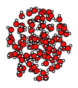

.. code:: ipython3

    print("2-1 water-acetonitrile mixture surrounding an Al slab, from mole fractions and an approximate density")
    out = packmol_around(slab, [water, acetonitrile], mole_fractions=[x_water, x_acetonitrile], density=density)
    printsummary(out)
    out.write("al-water-acetonitrile.xyz")
    plot_molecule(out, figsize=figsize, rotation=rotation);

.. parsed-literal::

    2-1 water-acetonitrile mixture surrounding an Al slab, from mole fractions and an approximate density
    480 atoms, density = 1.282 g/cm^3, box = 11.455, 14.881, 34.677, formula = C68H238Al72N34O68

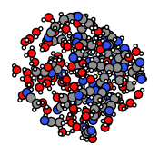

.. code:: ipython3

    from ase.build import surface
    
    print("water surrounding non-orthorhombic Au(211) slab, from an approximate number of molecules")
    print("NOTE: non-orthorhombic cell, results are approximate")
    slab = surface("Au", (2, 1, 1), 6)
    slab.center(vacuum=11.0, axis=2)
    slab.set_pbc(True)
    out = packmol_around(fromASE(slab), [water], n_molecules=[32], tolerance=1.8)
    out.write("Au211-water.xyz")
    plot_molecule(out, figsize=figsize, rotation=rotation)
    print(f"{out.lattice=}")

.. parsed-literal::

    water surrounding non-orthorhombic Au(211) slab, from an approximate number of molecules
    NOTE: non-orthorhombic cell, results are approximate
    out.lattice=[(9.1231573482, 0.0, 0.0), (3.6492629392999993, 4.4694160692, 0.0), (0.0, 0.0, 31.161091638)]

.. image:: PackMol_files/PackMol_35_1.png

Pack inside voids in crystals
~~~~~~~~~~~~~~~~~~~~~~~~~~~~~

Use the ``packmol_around`` function. You can decrease ``tolerance`` if
you need to pack very tightly. The default value for ``tolerance`` is
2.0.

.. code:: ipython3

    from scm.plams import fromASE
    from ase.build import bulk
    
    bulk_Al = fromASE(bulk("Al", cubic=True).repeat((3, 3, 3)))
    rotation = "-85x,5y,0z"
    plot_molecule(bulk_Al, rotation=rotation, radii=0.4);

.. image:: PackMol_files/PackMol_37_0.png

.. code:: ipython3

    out = packmol_around(
        current=bulk_Al,
        molecules=[from_smiles("[H]"), from_smiles("[He]")],
        n_molecules=[50, 20],
        tolerance=1.5,
    )
    plot_molecule(out, rotation=rotation, radii=0.4)
    printsummary(out)
    out.write("al-bulk-with-h-he.xyz")

.. parsed-literal::

    178 atoms, density = 2.819 g/cm^3, box = 12.150, 12.150, 12.150, formula = Al108H50He20

Bonds, atom properties (force field types, regions, …)
~~~~~~~~~~~~~~~~~~~~~~~~~~~~~~~~~~~~~~~~~~~~~~~~~~~~~~

The ``packmol()`` function accepts the arguments ``keep_bonds`` and
``keep_atom_properties``. These options will keep the bonds defined for
the constitutent molecules, as well as any atomic properties.

The bonds and atom properties are easiest to see by printing the System
block for an AMS job:

.. code:: ipython3

    from scm.plams import Settings
    
    water = from_smiles("O")
    n2 = from_smiles("N#N")
    
    # delete properties coming from from_smiles
    for at in water:
        at.properties = Settings()
    for at in n2:
        at.properties = Settings()
    
    water[1].properties.region = "oxygen_atom"
    water[2].properties.mass = 2.014  # deuterium
    water.delete_bond(water[1, 2])  # delete bond between atoms 1 and 2 (O and H)

.. code:: ipython3

    from scm.plams import AMSJob
    
    out = packmol([water, n2], n_molecules=[2, 1], density=0.5)
    print(AMSJob(molecule=out).get_input())

.. parsed-literal::

    System
      Atoms
                  O       4.1868320000       4.4500920000       1.8690070000 region=mol0,oxygen_atom
                  H       4.9590880000       4.9673550000       2.1803550000 mass=2.014 region=mol0
                  H       3.6334950000       4.9619400000       1.2396860000 region=mol0
                  O       4.9424240000       1.9897370000       0.9183610000 region=mol0,oxygen_atom
                  H       4.9815840000       1.0191060000       1.0495930000 mass=2.014 region=mol0
                  H       4.0386210000       2.3429420000       1.0686990000 region=mol0
                  N       4.8437790000       1.3182120000       3.2341500000 region=mol1
                  N       4.3966890000       1.2649030000       4.2487370000 region=mol1
      End
      BondOrders
         1 3 1.0
         4 6 1.0
         7 8 3.0
      End
      Lattice
             5.9692549746     0.0000000000     0.0000000000
             0.0000000000     5.9692549746     0.0000000000
             0.0000000000     0.0000000000     5.9692549746
      End
    End
    

By default, the ``packmol()`` function assigns regions called ``mol0``,
``mol1``, etc. to the different added molecules. The ``region_names``
option lets you set custom names.

.. code:: ipython3

    out = packmol(
        [water, n2],
        n_molecules=[2, 1],
        density=0.5,
        region_names=["water", "nitrogen_molecule"],
    )
    print(AMSJob(molecule=out).get_input())

.. parsed-literal::

    System
      Atoms
                  O       4.9617580000       2.2332440000       1.6599170000 region=oxygen_atom,water
                  H       4.1774520000       2.4776920000       1.1251390000 mass=2.014 region=water
                  H       4.8211850000       2.4073480000       2.6160250000 region=water
                  O       4.1824310000       4.9939520000       1.8730120000 region=oxygen_atom,water
                  H       5.0127480000       4.4730110000       1.8816480000 mass=2.014 region=water
                  H       3.7965120000       5.0520740000       0.9719550000 region=water
                  N       0.9478880000       3.8558950000       1.9641230000 region=nitrogen_molecule
                  N       1.8296180000       4.1568080000       1.3606970000 region=nitrogen_molecule
      End
      BondOrders
         1 3 1.0
         4 6 1.0
         7 8 3.0
      End
      Lattice
             5.9692549746     0.0000000000     0.0000000000
             0.0000000000     5.9692549746     0.0000000000
             0.0000000000     0.0000000000     5.9692549746
      End
    End
    

Below, we also set ``keep_atom_properties=False``, this will remove the
previous regions (in this example “oxygen_atom”) and mass.

.. code:: ipython3

    out = packmol([water, n2], n_molecules=[2, 1], density=0.5, keep_atom_properties=False)
    print(AMSJob(molecule=out).get_input())

.. parsed-literal::

    System
      Atoms
                  O       1.2922270000       3.3160950000       3.5142980000 region=mol0
                  H       1.9940210000       3.1635420000       2.8471450000 region=mol0
                  H       1.3400110000       4.2198660000       3.8952550000 region=mol0
                  O       2.0561390000       1.6731900000       1.3318470000 region=mol0
                  H       2.2821350000       1.0258670000       2.0324020000 region=mol0
                  H       1.0879980000       1.7182780000       1.1740960000 region=mol0
                  N       2.8191350000       1.0085650000       4.9655680000 region=mol1
                  N       1.7342850000       1.2434740000       4.9594530000 region=mol1
      End
      BondOrders
         1 3 1.0
         4 6 1.0
         7 8 3.0
      End
      Lattice
             5.9692549746     0.0000000000     0.0000000000
             0.0000000000     5.9692549746     0.0000000000
             0.0000000000     0.0000000000     5.9692549746
      End
    End
    

``keep_bonds=False`` will additionally ignore any defined bonds:

.. code:: ipython3

    out = packmol(
        [water, n2],
        n_molecules=[2, 1],
        density=0.5,
        region_names=["water", "nitrogen_molecule"],
        keep_bonds=False,
        keep_atom_properties=False,
    )
    print(AMSJob(molecule=out).get_input())

.. parsed-literal::

    System
      Atoms
                  O       2.0075010000       3.8174160000       4.9838470000 region=water
                  H       2.4140220000       2.9254410000       4.9834030000 region=water
                  H       1.0265950000       3.7722760000       4.9840460000 region=water
                  O       1.4781560000       3.6028820000       2.6012400000 region=water
                  H       2.3307040000       3.1618840000       2.4023410000 region=water
                  H       1.6051760000       4.5361890000       2.8787640000 region=water
                  N       1.5376520000       1.0427900000       1.0074390000 region=nitrogen_molecule
                  N       1.7385590000       1.0476680000       2.0991030000 region=nitrogen_molecule
      End
      Lattice
             5.9692549746     0.0000000000     0.0000000000
             0.0000000000     5.9692549746     0.0000000000
             0.0000000000     0.0000000000     5.9692549746
      End
    End
    

