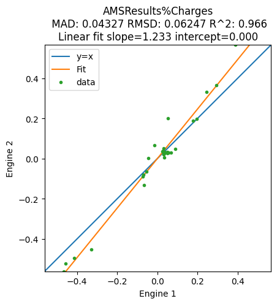

Worked Example
--------------

Initial imports
~~~~~~~~~~~~~~~

.. code:: ipython3

    import scm.plams as plams
    from scm.plams.tools.plot import plot_correlation, get_correlation_xy
    import matplotlib.pyplot as plt

Define two engines to compare
~~~~~~~~~~~~~~~~~~~~~~~~~~~~~

Here we choose GFNFF and GFN1-xTB

.. code:: ipython3

    e1 = plams.Settings()
    e1.input.GFNFF
    
    e2 = plams.Settings()
    e2.input.DFTB.Model = "GFN1-xTB"

Let’s use a glycine molecule generated from SMILES:

.. code:: ipython3

    glycine = plams.from_smiles("C(C(=O)O)N")
    plams.plot_molecule(glycine);

Run a single-point calculation storing the Gradients (negative forces):

.. code:: ipython3

    sp = plams.Settings()
    sp.input.ams.Task = "SinglePoint"
    sp.input.ams.Properties.Gradients = "Yes"
    sp.runscript.nproc = 1  # run in serial

.. code:: ipython3

    job1 = plams.AMSJob(settings=sp + e1, name="glycine-engine1", molecule=glycine)
    job2 = plams.AMSJob(settings=sp + e2, name="glycine-engine2", molecule=glycine)

.. code:: ipython3

    job1.run()
    job2.run()

.. parsed-literal::

    [23.10|17:57:51] JOB glycine-engine1 STARTED
    [23.10|17:57:51] JOB glycine-engine1 RUNNING
    [23.10|17:57:52] JOB glycine-engine1 FINISHED
    [23.10|17:57:52] JOB glycine-engine1 SUCCESSFUL
    [23.10|17:57:52] JOB glycine-engine2 STARTED
    [23.10|17:57:52] JOB glycine-engine2 RUNNING
    [23.10|17:57:52] JOB glycine-engine2 FINISHED
    [23.10|17:57:52] JOB glycine-engine2 SUCCESSFUL

.. parsed-literal::

    <scm.plams.interfaces.adfsuite.ams.AMSResults at 0x150757ca0>

.. code:: ipython3

    plot_correlation(
        job1,
        job2,
        section="AMSResults",
        variable="Gradients",
        file="engine",
    );

To get the actual numbers, use ``get_correlation_xy``:

.. code:: ipython3

    x, y = plams.tools.plot.get_correlation_xy(job1, job2, section="AMSResults", variable="Gradients", file="engine")
    print("x")
    print(x)
    print("y")
    print(y)

.. parsed-literal::

    x
    [-0.02618337 -0.02185398 -0.00569558 -0.00728149 -0.02743453  0.00760765
      0.02840358  0.05185629 -0.02249499 -0.00930743 -0.0496023   0.03370857
      0.00630104 -0.00342449 -0.00515473  0.01226365  0.01222411 -0.01690943
      0.00674109  0.01271709  0.01819203  0.00787463  0.00516595 -0.01108063
     -0.00154521  0.01105898  0.0037783  -0.01726648  0.00929288 -0.00195118]
    y
    [-0.03408318 -0.01360583 -0.00908411 -0.00699156 -0.0362322   0.01994845
      0.03482779  0.08117168 -0.04550755  0.00640144 -0.08007524  0.06008221
     -0.01476529 -0.01611956 -0.0109011   0.01657241  0.01123652 -0.01511969
      0.00813057  0.01138332  0.01821275  0.0071558   0.00602574 -0.0121942
      0.0019932   0.00620757  0.00153412 -0.01924117  0.03000799 -0.00697089]

Compare multiple jobs
~~~~~~~~~~~~~~~~~~~~~

.. code:: ipython3

    smiles_list = ["CC=C", "CCCO", "C(C(=O)O)N"]
    names = ["propene", "propanol", "glycine"]
    molecules = [plams.from_smiles(x) for x in smiles_list]
    for mol in molecules:
        plams.plot_molecule(mol)

.. image:: plot_correlation_files/plot_correlation_14_2.png

.. code:: ipython3

    jobs1 = [plams.AMSJob(settings=sp + e1, name="e1" + name, molecule=mol) for name, mol in zip(names, molecules)]
    jobs2 = [plams.AMSJob(settings=sp + e2, name="e2" + name, molecule=mol) for name, mol in zip(names, molecules)]

.. code:: ipython3

    for job in jobs1 + jobs2:
        job.run()

.. parsed-literal::

    [23.10|17:57:52] JOB e1propene STARTED
    [23.10|17:57:52] JOB e1propene RUNNING
    [23.10|17:57:53] JOB e1propene FINISHED
    [23.10|17:57:53] JOB e1propene SUCCESSFUL
    [23.10|17:57:53] JOB e1propanol STARTED
    [23.10|17:57:53] JOB e1propanol RUNNING
    [23.10|17:57:53] JOB e1propanol FINISHED
    [23.10|17:57:53] JOB e1propanol SUCCESSFUL
    [23.10|17:57:53] JOB e1glycine STARTED
    [23.10|17:57:53] Job e1glycine previously run as glycine-engine1, using old results
    [23.10|17:57:53] JOB e1glycine COPIED
    [23.10|17:57:53] JOB e2propene STARTED
    [23.10|17:57:53] JOB e2propene RUNNING
    [23.10|17:57:53] JOB e2propene FINISHED
    [23.10|17:57:53] JOB e2propene SUCCESSFUL
    [23.10|17:57:53] JOB e2propanol STARTED
    [23.10|17:57:53] JOB e2propanol RUNNING
    [23.10|17:57:54] JOB e2propanol FINISHED
    [23.10|17:57:54] JOB e2propanol SUCCESSFUL
    [23.10|17:57:54] JOB e2glycine STARTED
    [23.10|17:57:54] Job e2glycine previously run as glycine-engine2, using old results
    [23.10|17:57:54] JOB e2glycine COPIED

The correlation plot can be plotted as before. You can also add a unit
conversion to get your preferred units, and add custom xlabel and
ylabel:

.. code:: ipython3

    unit = "eV/angstrom"
    multiplier = plams.Units.convert(1.0, "hartree/bohr", unit)
    
    plot_correlation(
        jobs1,
        jobs2,
        section="AMSResults",
        variable="Gradients",
        file="engine",
        xlabel="Engine 1",
        ylabel="Engine 2",
        unit=unit,
        multiplier=multiplier,
    );

.. code:: ipython3

    plot_correlation(
        jobs1,
        jobs2,
        section="AMSResults",
        variable="Charges",
        file="engine",
        xlabel="Engine 1",
        ylabel="Engine 2",
    );

Use Task Replay to compare multiple frames from a trajectory
~~~~~~~~~~~~~~~~~~~~~~~~~~~~~~~~~~~~~~~~~~~~~~~~~~~~~~~~~~~~

The forces from an MD job can be stored with
``writeenginegradients=True``

.. code:: ipython3

    md = plams.AMSNVEJob(
        settings=e1,
        name="nve-md-e1",
        molecule=glycine,
        velocities=400,
        nsteps=100,
        samplingfreq=10,
        writeenginegradients=True,
    )
    md.run()

.. parsed-literal::

    [23.10|17:57:54] JOB nve-md-e1 STARTED
    [23.10|17:57:54] JOB nve-md-e1 RUNNING
    [23.10|17:57:56] JOB nve-md-e1 FINISHED
    [23.10|17:57:56] JOB nve-md-e1 SUCCESSFUL

.. parsed-literal::

    <scm.plams.interfaces.adfsuite.ams.AMSResults at 0x15d0a65e0>

When using the Replay task, set ``Properties.Gradients`` to get the
forces:

.. code:: ipython3

    replay_s = plams.Settings()
    replay_s.input.ams.Task = "Replay"
    replay_s.input.ams.Properties.Gradients = "Yes"
    replay_s.input.ams.Replay.File = md.results.rkfpath()
    replay = plams.AMSJob(settings=e2 + replay_s, name="replay-e2")
    replay.run()

.. parsed-literal::

    [23.10|17:57:56] JOB replay-e2 STARTED
    [23.10|17:57:56] JOB replay-e2 RUNNING
    [23.10|17:57:58] JOB replay-e2 FINISHED
    [23.10|17:57:58] JOB replay-e2 SUCCESSFUL

.. parsed-literal::

    <scm.plams.interfaces.adfsuite.ams.AMSResults at 0x15d062190>

For the MD job the gradients (negative forces) are stored in
``History%EngineGradients``, but for the Replay job they are stored in
``History%Gradients``. Use the ``alt_variable`` to specify the variable
for the second job:

.. code:: ipython3

    plot_correlation(md, replay, section="History", variable="EngineGradients", alt_variable="Gradients", file="ams");

