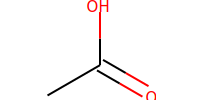

Worked Example
--------------

Creating 2D images of molecules
~~~~~~~~~~~~~~~~~~~~~~~~~~~~~~~

.. code:: ipython3

   from IPython.display import SVG
   from scm.plams import ReactionEquation
   from scm.plams import from_smiles, to_image, get_reaction_image

   aspirin = from_smiles("CC(=O)OC1=CC=CC=C1C(=O)O")
   text = to_image(aspirin)
   SVG(text)

It is also possible to write the image to file in a range of different formats (SVG, PNG, EPS, PDF, JPEG)

.. code:: ipython3

   text = to_image(aspirin, filename="aspirin.svg")
   text = to_image(aspirin, filename="aspiring.png")

Creating 2D imageas of reactions
~~~~~~~~~~~~~~~~~~~~~~~~~~~~~~~~

We can have aspirin react with water to form acetic acid and salicylic acid

.. code:: ipython3

   acetic_acid = from_smiles("CC(O)=O")
   text = to_image(acetic_acid)
   SVG(text)

.. code:: ipython3

   salicylic_acid = from_smiles("O=C(O)c1ccccc1O")
   text = to_image(salicylic_acid)
   SVG(text)

We can create a 2D image of the reaction as well, and optionally store it to file

.. code:: ipython3

   reactants = [aspirin, from_smiles("O")]
   products = [acetic_acid, salicylic_acid]
   text = get_reaction_image(reactants, products, filename="reaction.svg")
   SVG(text)

