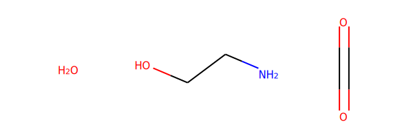
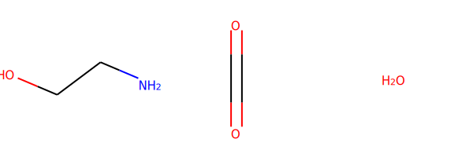
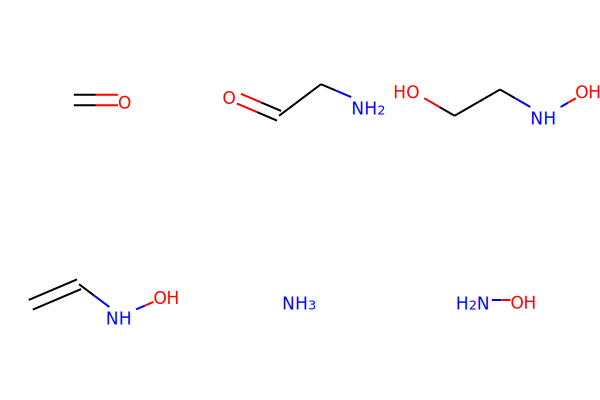
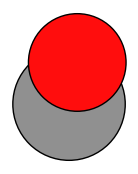
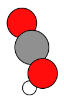

Worked Example
--------------

Initial imports
~~~~~~~~~~~~~~~

.. code:: ipython3

    from typing import List
    import scm.plams as plams
    from scm.input_classes import engines
    from scm.reactions_discovery import ReactionsDiscoveryJob
    from rdkit import Chem
    from rdkit.Chem import Draw
    
    # Settings for displaying molecules in the notebook
    from rdkit.Chem.Draw import IPythonConsole
    
    IPythonConsole.ipython_useSVG = True
    IPythonConsole.molSize = 250, 250

Helpers for showing molecules
~~~~~~~~~~~~~~~~~~~~~~~~~~~~~

.. code:: ipython3

    def draw_molecules(molecules: List[plams.Molecule]):
        smiles = [molecule.properties.smiles for molecule in molecules]
        return draw_smiles(smiles)
    
    
    def draw_smiles(smiles: List[str]):
        rd_mols = [Chem.MolFromSmiles(s) for s in smiles]
        return Draw.MolsToGridImage(rd_mols)

The ReactionsDiscoveryJob class
~~~~~~~~~~~~~~~~~~~~~~~~~~~~~~~

.. code:: ipython3

    job = ReactionsDiscoveryJob(name="MyDiscovery")
    driver = job.input
    md = driver.MolecularDynamics

Setting up the reactants for molecular dynamics
~~~~~~~~~~~~~~~~~~~~~~~~~~~~~~~~~~~~~~~~~~~~~~~

.. code:: ipython3

    md.NumSimulations = 4
    build = md.BuildSystem
    build.NumAtoms = 250
    build.Density = 0.9
    build.Molecule[0].SMILES = "O"  # Water
    build.Molecule[0].MoleFraction = 1
    build.Molecule[1].SMILES = "NCCO"  # MEA
    build.Molecule[1].MoleFraction = 2
    build.Molecule[2].SMILES = "O=C=O"  # Carbondioxide
    build.Molecule[2].MoleFraction = 3
    draw_smiles([build.Molecule[i].SMILES.val for i in range(len(build.Molecule))])

Setting up reactive molecular dynamics
~~~~~~~~~~~~~~~~~~~~~~~~~~~~~~~~~~~~~~

.. code:: ipython3

    md.Enabled = "Yes"
    md.Type = "NanoReactor"
    reactor = md.NanoReactor
    reactor.NumCycles = 10
    reactor.Temperature = 500
    reactor.MinVolumeFraction = 0.6

Setting up network extraction and ranking
~~~~~~~~~~~~~~~~~~~~~~~~~~~~~~~~~~~~~~~~~

.. code:: ipython3

    network = driver.NetworkExtraction
    network.Enabled = "Yes"
    network.UseCharges = "Yes"
    ranking = driver.ProductRanking
    ranking.Enabled = "Yes"

Selecting the AMS engine to use
~~~~~~~~~~~~~~~~~~~~~~~~~~~~~~~

.. code:: ipython3

    engine = engines.ReaxFF()
    engine.ForceField = "Glycine.ff"
    engine.TaperBO = "Yes"  # This is a really important setting for reaction analysis with ReaxFF potentials
    driver.Engine = engine

Running reactions discovery
~~~~~~~~~~~~~~~~~~~~~~~~~~~

.. code:: ipython3

    result = job.run()  # start the job
    job.check()  # check if job was succesful

.. parsed-literal::

    [04.10|16:18:26] JOB MyDiscovery STARTED
    [04.10|16:18:26] JOB MyDiscovery RUNNING
    [04.10|16:20:11] JOB MyDiscovery FINISHED
    [04.10|16:20:11] JOB MyDiscovery SUCCESSFUL

.. parsed-literal::

    True

Obtain the results
~~~~~~~~~~~~~~~~~~

.. code:: ipython3

    graph, molecules, categories = result.get_network()

.. parsed-literal::

      0   1   2   3   4   5   6   7   8   9  10  11  12  13  14  15  16  17  18  19  20  21  22  23  24 
     25  26  27  28  29  30  31  32  33  34  35  36  37  38  39  40  41  42  43  44  45  46  47  48  49 
     50  51  52  53  54  55  56  57  58  59  60  61  62  63  64  65  66  67  68  69  70  71  72  73  74 
     75  76  77  78  79  80  81  82  83  84  85  86  87  88  89  90  91  92  93  94  95  96  97  98  99 
    100 101 102 103 104 105 106 107 108 109 110 111 112 113 114 115 116 117 118 119 120 121 122 123 124 
    125 126 127 128 129 130 131 132 133 134 135 136 137 138 139 140 141 142 143 144 145 146 147 148 149 
    150 151 152 153 154 155 156 157 158 159 160 161 162 163 164 165 166 167 168 169 170 171 172 173 174 
    175 176 177 178 179 180 181 182 183 184 185 186 187 188 189 190 191 192 193 194 195 196 197 198 199 
    200 201 202 203 204 205 206 207 208 209 210 211 212 213 214 215 216 217 218 219 220 221 222 223 224 
    225 226 227 228 229 230 231 232 233 234 235 236 237 238 239 240 241 242 243 244 245 246 247 248 249 
    250 251 252 253 254 255 256 257 258 259 260 261 262 263 264 265 266 267 268 269 270 271 272 273 274 
    275 276 277 278 279 280 281 282 283 284 285 286 287 288 289 290 291 292 293 294 295 296 297 298 299 
    300 301 302 303 304 305 306 307 308 309 310 311 312 313 314 315 316 317 318 319 320 321 322 323 324 
    

Categories
~~~~~~~~~~

The categories are ``Products`` ``Reactants`` and ``Unstable``, as
described in the reactions discovery manual. ``molecules`` is a
dictionairy with keys equal to the categories and each concomitant value
is a list of PLAMS molecules.

.. code:: ipython3

    print(categories)

.. parsed-literal::

    ['Unstable', 'Reactants', 'Products']

.. code:: ipython3

    draw_molecules(molecules["Reactants"])

Products
~~~~~~~~

These are the side products that reactions discovery found in the order
as found by the ranking algorithm.

.. code:: ipython3

    draw_molecules(molecules["Products"][:6])

Unstable
~~~~~~~~

Unstable products were determined to not likely exist outside of
reactive dynamics. This e.g. includes radicals or structures that don’t
form stable molecules in isolation. Not all unstable molecules have a
sensible 2d structure, so instead we plot their 3d structure.

.. code:: ipython3

    for unstable_molecule in molecules["Unstable"][:3]:
        plams.plot_molecule(unstable_molecule);

.. image:: reactions_discovery_files/reactions_discovery_24_1.png

Graph of the reaction network
~~~~~~~~~~~~~~~~~~~~~~~~~~~~~

The graph is a bipartate networkx DiGraph with reaction and molecule
nodes. This can be stored on disk in standard graph formats,
e.g. ``.gml``

.. code:: ipython3

    import networkx as nx
    
    nx.write_gml(graph, "reaction_network.gml")

Load a job not originally run by PLAMS
~~~~~~~~~~~~~~~~~~~~~~~~~~~~~~~~~~~~~~

.. code:: ipython3

    job = ReactionsDiscoveryJob.load_external("plams_workdir/MyDiscovery")

.. code:: ipython3

    graph, molecules, categories = job.results.get_network()

.. parsed-literal::

      0   1   2   3   4   5   6   7   8   9  10  11  12  13  14  15  16  17  18  19  20  21  22  23  24 
     25  26  27  28  29  30  31  32  33  34  35  36  37  38  39  40  41  42  43  44  45  46  47  48  49 
     50  51  52  53  54  55  56  57  58  59  60  61  62  63  64  65  66  67  68  69  70  71  72  73  74 
     75  76  77  78  79  80  81  82  83  84  85  86  87  88  89  90  91  92  93  94  95  96  97  98  99 
    100 101 102 103 104 105 106 107 108 109 110 111 112 113 114 115 116 117 118 119 120 121 122 123 124 
    125 126 127 128 129 130 131 132 133 134 135 136 137 138 139 140 141 142 143 144 145 146 147 148 149 
    150 151 152 153 154 155 156 157 158 159 160 161 162 163 164 165 166 167 168 169 170 171 172 173 174 
    175 176 177 178 179 180 181 182 183 184 185 186 187 188 189 190 191 192 193 194 195 196 197 198 199 
    200 201 202 203 204 205 206 207 208 209 210 211 212 213 214 215 216 217 218 219 220 221 222 223 224 
    225 226 227 228 229 230 231 232 233 234 235 236 237 238 239 240 241 242 243 244 245 246 247 248 249 
    250 251 252 253 254 255 256 257 258 259 260 261 262 263 264 265 266 267 268 269 270 271 272 273 274 
    275 276 277 278 279 280 281 282 283 284 285 286 287 288 289 290 291 292 293 294 295 296 297 298 299 
    300 301 302 303 304 305 306 307 308 309 310 311 312 313 314 315 316 317 318 319 320 321 322 323 324 
    

