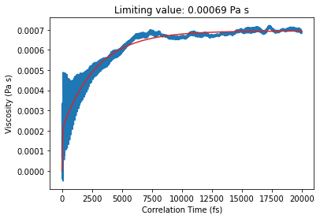

.. _ViscosityGreenKuboExample:

Viscosity from Green-Kubo relation
==================================

This example sets up a short MD simulation of liquid benzene and calculates the viscosity using the Green-Kubo relation. The experimental value is about 0.5 mPa s at room temperature.

.. image:: ViscosityGreenKubo_files/ViscosityGreenKubo_3_0.png

.. seealso::

   - `Tutorial for calculating viscosity <../../../Tutorials/MolecularDynamicsAndMonteCarlo/ViscosityBenzene.html>`__ with the AMS graphical user interface

   - :class:`AMSViscosityFromBinLogJob <scm.plams.recipes.md.trajectoryanalysis.AMSViscosityFromBinLogJob>` documentation

..
   Feel free to modify the above label, header, and add any custom information here

.. include:: ViscosityGreenKubo.common_header.rst
.. include:: ViscosityGreenKubo.ipynb.rst
.. include:: ViscosityGreenKubo.common_footer.rst
